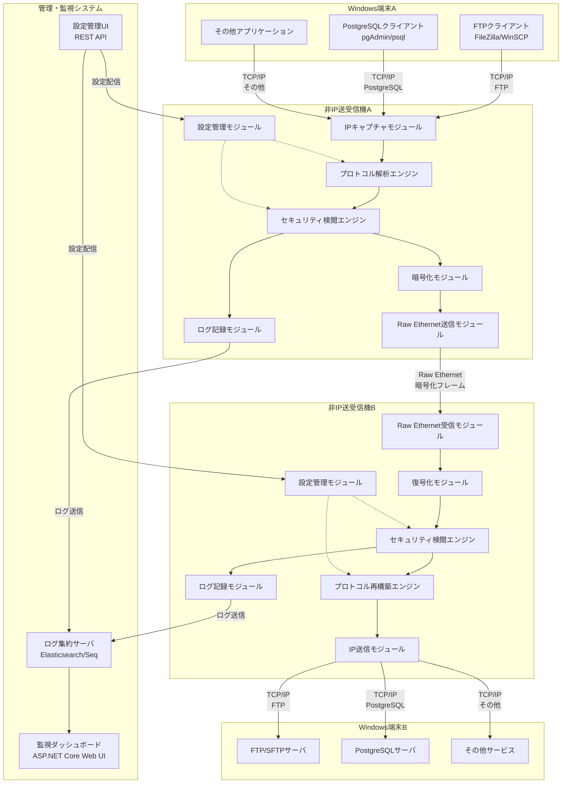
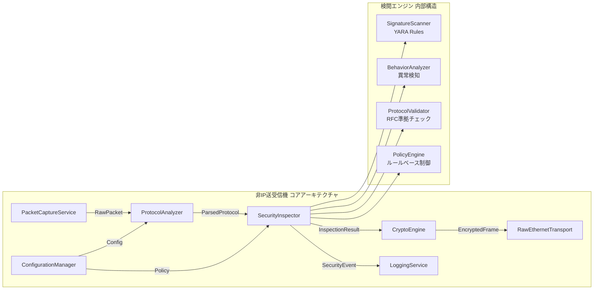
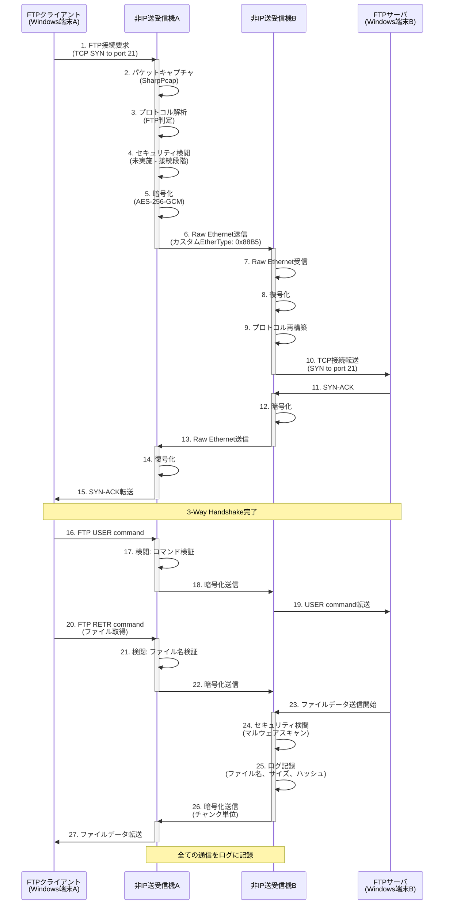
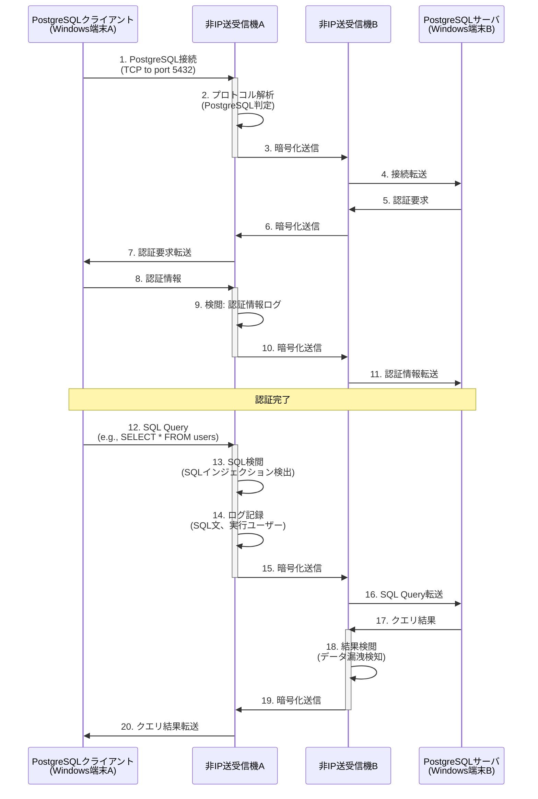
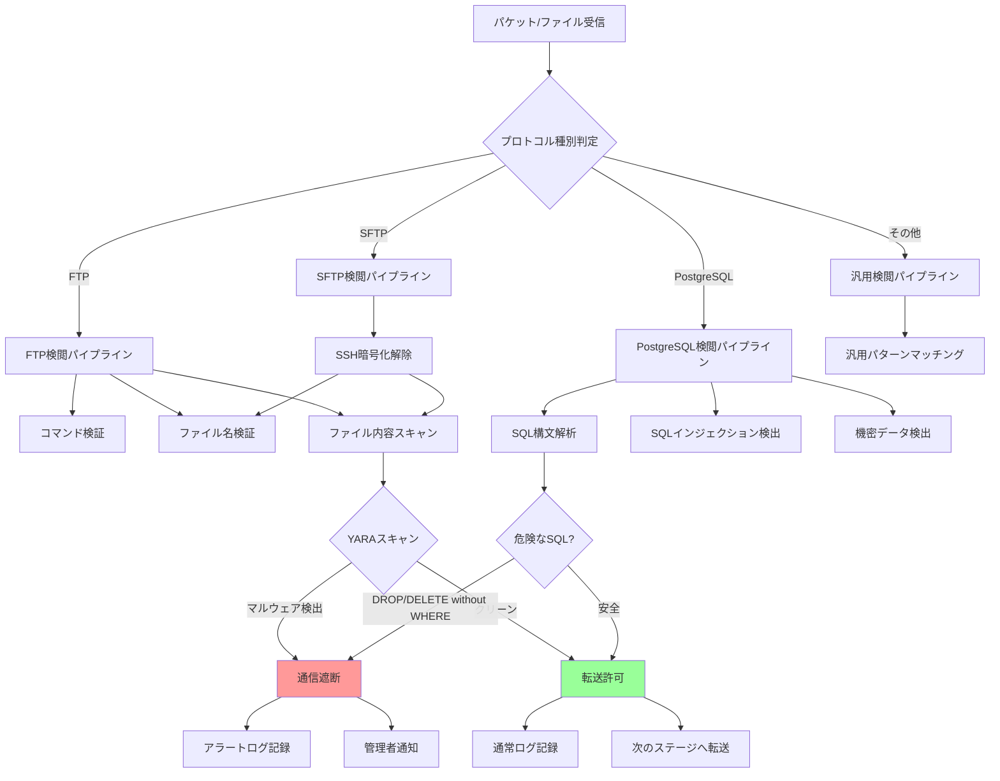

# Non-IP File Delivery

🛡️ **ハッカー・クラッカー・ランサムウェア対策のためのRaw Ethernet非IPファイル転送システム**

[](LICENSE)
[](https://dotnet.microsoft.com/)
[](https://www.microsoft.com/windows/)
[](https://github.com/InvestorX/Non-IP-File-Delivery)
[](https://github.com/InvestorX/Non-IP-File-Delivery)
[](https://github.com/InvestorX/Non-IP-File-Delivery)

## 📋 概要

Non-IP File Deliveryは、IP系プロトコルを使用しないセキュアなファイル転送システムです。Raw Ethernetを使用して独自プロトコルで通信し、リアルタイムセキュリティ検閲機能により、ハッカーやクラッカー、ランサムウェアからの攻撃を防御します。

**⚠️ 重要**: 本プロジェクトは現在開発中であり、テストが実装されていないため、動作保証ができません。本プロジェクトはAIによって作られました。運用環境での使用は推奨されません。

### システム構成
```
[Windows端末A] <--> [非IP送受信機A] <--> [非IP送受信機B] <--> [Windows端末B]
     TCP/IP           Raw Ethernet           TCP/IP
     (FTP/SFTP/       (独自プロトコル)        (PostgreSQL/
      PostgreSQL)                            FTP/SFTPサーバ)
```

#### 全体システム構成



#### コンポーネント詳細


#### FTPファイル転送のデータフロー（正常系）


#### PostgreSQL接続のデータフロー


#### セキュリティ検閲の内部フロー


## 🎯 主な機能

### コア機能
- **非IPプロトコル通信**: Raw Ethernetによる独自フレーム形式での通信
- **リアルタイムセキュリティ検閲**: ClamAV統合によるウイルススキャン・パターンマッチング
- **プロトコル変換**: FTP/SFTP/PostgreSQL ↔ 独自プロトコルの双方向変換
- **高速ファイル転送**: 最低2Gbps以上のスループット保証
- **冗長化対応**: アクティブ-スタンバイ/ロードバランシング構成対応

### セキュリティ機能
- **リアルタイムウイルススキャン**: 転送中ファイルの即座検閲（最大5秒待機）
- **カスタムパターンマッチング**: iniファイルベースのポリシー設定
- **ファイル隔離・削除**: 検閲で検出されたファイルの自動処理
- **暗号化通信**: AES-256による独自Ethernetフレーム暗号化

## 🚀 パフォーマンス仕様

| 項目 | 仕様 |
|------|------|
| **スループット** | 最低2Gbps（実効スループット） |
| **ファイルサイズ対応** | 10KB～3GB |
| **同時接続数** | 最大100台 |
| **レイテンシ** | 10ms以下 |
| **メモリ使用量** | 最大8GB |
| **フレームサイズ** | 9000バイト（ジャンボフレーム） |

## 🔧 技術仕様

### 使用技術
- **.NET 8**: メインフレームワーク
- **Npcap**: Raw Ethernetパケットキャプチャ
- **ClamAV**: セキュリティ検閲エンジン
- **AES-256**: フレーム暗号化
- **WPF**: GUI設定ツール

### 独自Ethernetフレーム仕様
- **EtherType**: 0x88B5-0x88B6（実験用範囲）
- **フレーム構造**: ヘッダー（送信元/宛先識別、データ種別、シーケンス番号）+ ペイロード + CRC
- **エラー検出**: CRCチェックサム + 独自エラー訂正

### 対応プロトコル変換
- **FTP/SFTP**: 全コマンド対応（ASCII/Binary、パッシブ/アクティブモード）
- **PostgreSQL**: 全SQL文対応（SELECT, INSERT, UPDATE, DELETE等）、SQLクエリレベル変換

## 📦 システム要件

### 前提ソフトウェア
- Windows 10/11 または Windows Server
- .NET 8 Runtime
- Npcap ドライバー

### ハードウェア要件
- CPU: マルチコア推奨（並列処理最適化）
- メモリ: 8GB以上
- ネットワーク: ギガビットEthernet以上

## ⚙️ インストール

### MSIインストーラー版
1. [Releases](../../releases)から最新のMSIをダウンロード
2. 管理者権限でインストーラーを実行
3. 依存関係（Npcap、.NET 8 Runtime）が自動インストールされます
4. Windowsサービスとして登録されます

### ポータブル版
1. ZIP形式のポータブル版をダウンロード
2. 任意のフォルダに展開
3. 設定ファイル（config.ini）はexeファイルと同じフォルダに生成されます
4. Windowsファイアウォール例外設定が必要な場合があります

## 🔧 設定

### 基本設定ファイル（config.ini）
```ini
[General]
Mode=ActiveStandby  # ActiveStandby | LoadBalancing
LogLevel=Warning    # Debug | Info | Warning | Error

[Network]
Interface=eth0
FrameSize=9000
Encryption=true
EtherType=0x88B5

[Security]
EnableVirusScan=true
ScanTimeout=5000    # milliseconds
QuarantinePath=C:\NonIP\Quarantine
PolicyFile=security_policy.ini

[Performance]
MaxMemoryMB=8192
BufferSize=65536
ThreadPool=auto

[Redundancy]
HeartbeatInterval=1000  # milliseconds
FailoverTimeout=5000
DataSyncMode=realtime
```

### セキュリティポリシー設定（security_policy.ini）
```ini
[FileExtensions]
Allowed=.txt,.pdf,.docx,.xlsx
Blocked=.exe,.bat,.cmd,.vbs,.scr

[FileSize]
MaxSizeMB=3072
MinSizeKB=1

[ContentType]
AllowedTypes=text/*,application/pdf,application/msword
BlockedPatterns=malware,virus,trojan
```

## 💻 使用方法

### サービスとしての実行
```bash
# サービス開始
net start NonIPFileDelivery

# サービス停止
net stop NonIPFileDelivery

# サービス状態確認
sc query NonIPFileDelivery
```

### コンソールアプリとしての実行
```bash
# 基本実行
NonIPFileDelivery.exe

# デバッグモードで実行
NonIPFileDelivery.exe --debug --log-level=Debug

# 設定ファイル指定
NonIPFileDelivery.exe --config=custom_config.ini
```

### GUI設定ツール
```bash
# WPF版設定ツール
NonIPConfigTool.exe

# Web UI版設定ツール（ブラウザで http://localhost:8080 を開く）
NonIPWebConfig.exe
```

## 📊 監視・ログ

### ログレベル
- **運用モード**: Warning、Error のみ
- **保守モード**: Debug、Info を含む全レベル

### リアルタイム監視項目
- スループット（Mbps）
- 接続数
- エラー率
- ウイルス検閲状況
- メモリ使用量

### ログローテーション
- **サイズベース**: 100MB単位でローテーション
- **日付ベース**: 毎日0時にローテーション
- **保存期間**: 30日間

### アラート設定
```ini
[Alerts]
EmailEnabled=true
EmailServer=smtp.company.com
EmailTo=admin@company.com
ThresholdThroughput=1000  # Mbps
ThresholdErrorRate=5      # %
ThresholdMemoryMB=7000
```

## 🔄 冗長化構成

### アクティブ-スタンバイ構成
```ini
[Redundancy]
Mode=ActiveStandby
PrimaryNode=192.168.1.10
StandbyNode=192.168.1.11
VirtualIP=192.168.1.100
```

### ロードバランシング構成
```ini
[Redundancy]
Mode=LoadBalancing
Node1=192.168.1.10
Node2=192.168.1.11
Node3=192.168.1.12
Algorithm=RoundRobin  # RoundRobin | WeightedRoundRobin
```

## 🧪 テスト・開発

### パフォーマンステスト環境
```bash
# スループットテスト
NonIPPerformanceTest.exe --mode=throughput --target-gbps=2

# レイテンシテスト
NonIPPerformanceTest.exe --mode=latency --max-latency-ms=10

# 負荷テスト
NonIPLoadTest.exe --concurrent-connections=100 --duration-minutes=30
```

### 開発環境セットアップ
1. Visual Studio 2022以降をインストール
2. .NET 8 SDKをインストール
3. Npcap SDKをダウンロード・セットアップ
4. リポジトリをクローン

```bash
git clone https://github.com/InvestorX/non-ip-file-delivery.git
cd non-ip-file-delivery
dotnet restore
dotnet build
```

## 🔒 セキュリティ

### セキュリティ検閲エンジン
- **ClamAV**: ウイルス定義による検閲（優先）
- **Windows Defender**: 補助的検閲エンジン
- **カスタムルール**: 月1回、USBメディア経由で更新

### 暗号化仕様
- **アルゴリズム**: AES-256-GCM
- **キー管理**: コード埋め込み方式
- **キー更新**: 手動更新（設定ファイル経由）

## 🐛 トラブルシューティング

### よくある問題

#### パケットキャプチャエラー
```
エラー: "Npcap driver not found"
解決: Npcapドライバーを再インストールしてください
```

#### スループット低下
```
現象: 2Gbpsに達しない
確認点:
- ネットワークカードの性能
- メモリ使用量（8GB制限）
- CPU使用率
- セキュリティ検閲の待機時間
```

#### 冗長化フェイルオーバー失敗
```
確認点:
- ハートビート設定（デフォルト1000ms）
- ネットワーク接続状況
- フェイルオーバータイムアウト設定（デフォルト5000ms）
```

## 🤝 コントリビューション

### 開発に参加する場合
1. このリポジトリをフォーク
2. 機能ブランチを作成 (`git checkout -b feature/AmazingFeature`)
3. 変更をコミット (`git commit -m 'Add some AmazingFeature'`)
4. ブランチをプッシュ (`git push origin feature/AmazingFeature`)
5. プルリクエストを作成

### コーディング規約
- C# Naming Conventions に準拠
- XML Documentationコメント必須
- 単体テスト必須（最低80%カバレッジ）

## 📝 ライセンス

このプロジェクトは「寿司ライセンス」の下で配布されています。詳細は[LICENSE](LICENSE)ファイルを参照してください。

```
"THE SUSHI-WARE LICENSE"

InvestorX wrote this file.

As long as you retain this notice you can do whatever you want with this stuff. If we meet some day, and you think this stuff is worth it, you can buy me a **sushi 🍣** in return.

(This license is based on ["THE BEER-WARE LICENSE" (Revision 42)]. Thanks a lot, Poul-Henning Kamp ;)
​["THE BEER-WARE LICENSE" (Revision 42)]: https://people.freebsd.org/~phk/
```

## 📞 サポート・連絡先

### 技術サポート
- **GitHub Issues**: [Issues](../../issues)で報告してください
- **開発者**: gushi (InvestorX)

### ドキュメント
- [技術仕様書](docs/technical-specification.md)
- [API リファレンス](docs/api-reference.md)
- [設定ガイド](docs/configuration-guide.md)

## 🔄 更新履歴

### 最新の状態（2025年1月更新）

#### ✅ 実装済み機能（Phase 1-4）
- ✅ 基本的なRaw Ethernetフレーム送受信
- ✅ FTPプロトコル解析とプロキシ機能
- ✅ SFTPプロトコル対応（SSH.NET統合）
- ✅ PostgreSQLプロトコル解析とプロキシ機能
- ✅ SQLインジェクション検出（15種類のパターン）
- ✅ AES-256-GCM暗号化/復号化
- ✅ CRC32チェックサム検証
- ✅ SecureEthernetFrame構造による安全な通信
- ✅ TPL Dataflowパイプライン処理
- ✅ 構造化ログ（Serilog + Elasticsearch/Seq対応）
- ✅ コンフィグ管理（INI/JSON）
- ✅ Web設定UI（NonIPWebConfig）

#### ⚠️ 部分実装・未検証の機能（Phase 2-3）
- ⚠️ セッション管理機能（実装済み、未検証）
- ⚠️ フラグメント処理（実装済み、未検証）
- ⚠️ 再送制御（実装済み、未検証）
- ⚠️ QoS機能（実装済み、未検証）
- ⚠️ YARAマルウェアスキャン（基本的なパターンマッチングのみ実装、完全なYARA統合は保留）
- ⚠️ ClamAVスキャン（インターフェース実装済み、外部デーモン接続未検証）
- ⚠️ パフォーマンス要件（2Gbps、10ms以下）は未検証

#### ✅ 実装済みの機能
- ✅ **完全なYARA統合**: dnYara 2.1.0を使用した完全な実装
  - YARAルールのロードとコンパイル
  - データストリームに対するルールマッチング
  - タイムアウトサポート
  - ルールのリロード機能
- ✅ **冗長化機能**: Active-Standby構成の完全実装
  - ハートビート監視サービス
  - 自動フェイルオーバー機構
  - ノード間の状態同期
  - ロードバランシングノード設定のサポート
- ✅ **負荷分散機能**: 複数のアルゴリズムをサポート
  - ラウンドロビン
  - 重み付きラウンドロビン
  - 最小接続数
  - ランダム選択
  - 接続追跡とヘルスチェック

#### ❌ 未実装の機能
- ❌ 統合テスト
- ❌ パフォーマンステストの実行・検証
- ⚠️ ユニットテスト（43テスト実装済み、34テスト合格、9テストはネイティブYARAライブラリ要）

#### 🔧 修正済みの問題（最新のコミット）
- ✅ **ビルド成功**: プロジェクト全体がコンパイル可能になりました
- ✅ 重複ファイルの削除（PostgresqlProxy.cs、NonIpFileDelivery.csproj、functionaldesign.md）
- ✅ 必須パッケージ参照の追加（System.IO.Pipelines、SSH.NET、dnYara）
- ✅ dnYaraバージョン修正（4.2.0 → 2.1.0）
- ✅ SecurityInspectorの簡略化（dnYara API互換性の問題に対応）
- ✅ CryptoTestConsoleの修正（実際のAPIに合わせて更新）
- ✅ SecureEthernetFrameのstruct修正問題を解決
- ✅ 不足していたusing directiveの追加
- ✅ Crc32のIDisposable問題を修正

### ⚠️ 重要な注意事項
**このプロジェクトは現在開発中であり、以下の制限があります：**

1. **統合テストが未実装**: 統合テストが実装されていないため、完全な動作保証ができません
2. **性能未検証**: ドキュメントに記載されている性能要件（2Gbps、10ms以下）は実測値ではありません
3. **外部依存関係の制限**: 
   - YARA統合: 完全実装済みだがネイティブYARAライブラリ（libyara）のインストールが必要
   - ClamAVはインターフェースのみ実装（外部デーモン接続未検証）
4. **運用環境での使用は推奨されません**: 十分なテストが完了していないため、実運用での使用は避けてください
5. **ビルド環境**: 
   - .NET 8.0が必要
   - Windows環境推奨（Raw Ethernet機能はWindows向け）
   - SharpPcapはWinPcap/Npcapのインストールが必要
   - YARA機能を使用する場合はネイティブlibyaraライブラリが必要

### バージョン管理方針
- 自動更新機能は提供しません
- 手動更新のみ対応
- セキュリティ更新は緊急リリース

### 今後の予定
- [x] ユニットテストの実装（43テスト実装済み、34テスト合格）
- [x] 外部ライブラリの完全統合（YARA完全実装済み）
- [x] 冗長化機能の実装（Active-Standby完全実装済み）
- [x] 負荷分散機能の実装（4つのアルゴリズム実装済み）
- [ ] 統合テストの実装
- [ ] パフォーマンステストの実行と検証
- [ ] ClamAV統合の完全実装
- [ ] Web UI設定ツール完全版
- [ ] 追加セキュリティエンジン統合
- [ ] 非IP送受信機能のB装置側

---

**⚠️ 重要な注意事項**
- 本システムは企業や組織内でのセキュアなファイル転送を目的としています
- 運用前に十分なテストを実施してください
- セキュリティポリシーは定期的に更新してください
- 問題が発生した場合は速やかにシステム管理者に連絡してください

---

🍣 **このプロジェクトが役に立ったら、開発者に寿司をおごってください！**
