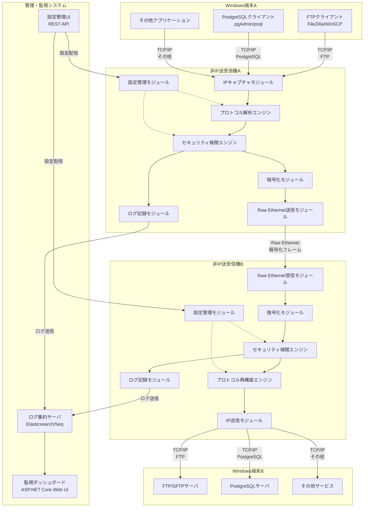
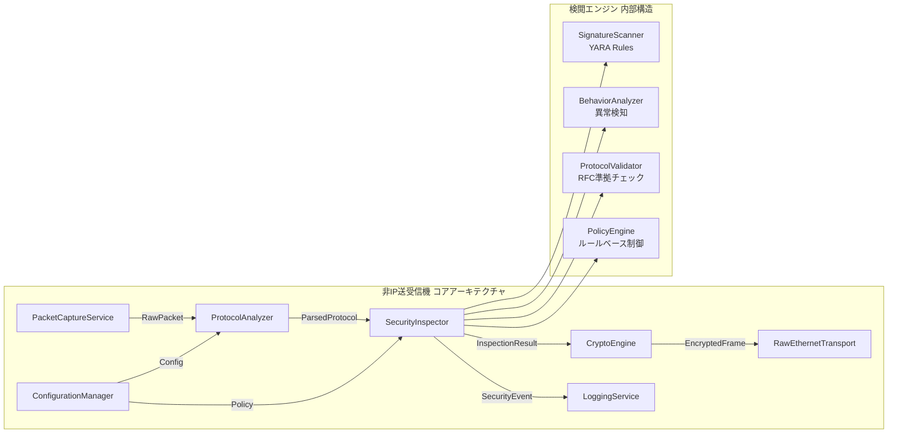
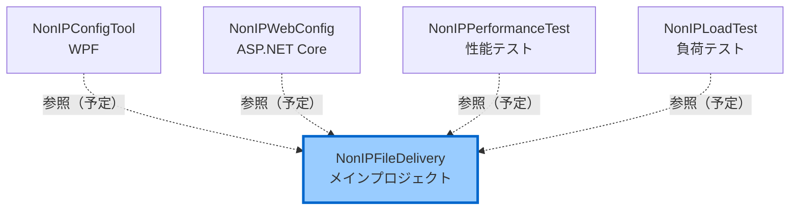
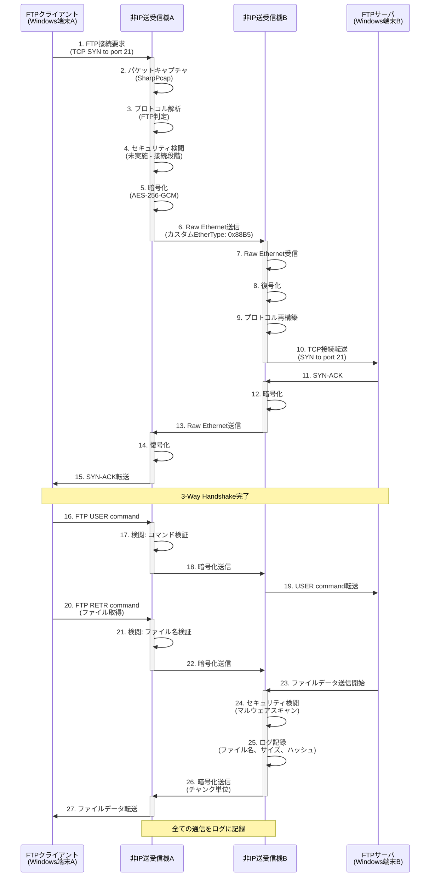
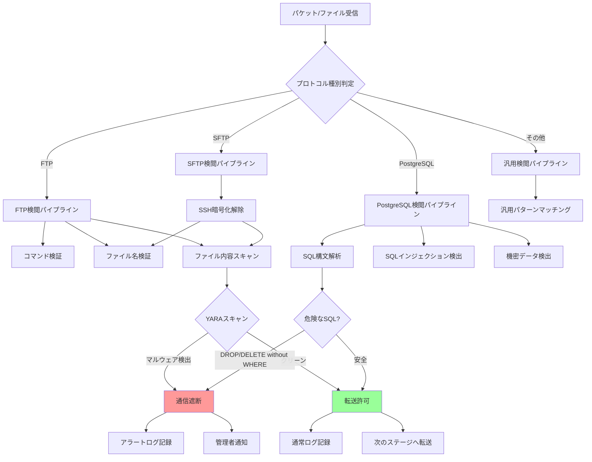

# Non-IP File Delivery システム 基本設計書 (Functional Design Document)

**バージョン**: 2.0 (既存実装反映版)  
**作成日**: 2025-10-02  
**最終更新**: 2025-10-02  
**作成者**: InvestorX  
**ステータス**: Stage 3.5完了（既存コード分析済み）

---

## 📋 目次

1. [ドキュメント情報](#1-ドキュメント情報)
2. [システムアーキテクチャ](#2-システムアーキテクチャ)
3. [プロジェクト構造](#3-プロジェクト構造)
4. [技術スタック](#4-技術スタック)
5. [データフロー](#5-データフロー)
6. [Custom Ethernet Frame仕様](#6-custom-ethernet-frame仕様)
7. [モジュール設計](#7-モジュール設計)
8. [設定ファイル仕様](#8-設定ファイル仕様)
9. [性能設計](#9-性能設計)
10. [既存実装の評価](#10-既存実装の評価)
11. [実装ギャップと追加実装計画](#11-実装ギャップと追加実装計画)

---

## 1. ドキュメント情報

### 1.1 概要

本ドキュメントは、Non-IP File Delivery システムの基本設計を記述したものです。
**既存実装（v1.1.0）** の詳細分析結果を反映し、Stage 2（基本設計）とStage 3.5（既存コード分析）の成果をまとめています。

### 1.2 参照ドキュメント

| ドキュメント | 場所 | 説明 |
|------------|------|------|
| README.md | ルートディレクトリ | システム概要、使用方法 |
| requirements.md | ルートディレクトリ | 要件定義書 |
| config.ini | ルートディレクトリ | 基本設定ファイル（サンプル） |
| security_policy.ini | ルートディレクトリ | セキュリティポリシー（サンプル） |

### 1.3 用語定義

| 用語 | 説明 |
|------|------|
| **非IP送受信機** | Raw Ethernetで独自プロトコル通信を行うシステム |
| **カスタムフレーム** | EtherType 0x88B5 を使用した独自Ethernetフレーム |
| **TPL Dataflow** | Task Parallel Library Dataflow（並列処理パイプライン） |
| **CRC32** | Cyclic Redundancy Check 32-bit（巡回冗長検査） |

---

## 2. システムアーキテクチャ

### 2.1 全体システム構成（README.md準拠）



### 2.2 コンポーネント詳細（README.md準拠）



### 2.3 既存実装のコンポーネントマッピング

| README.mdコンポーネント | 既存実装クラス | ファイル | 実装状況 |
|----------------------|--------------|---------|---------|
| **IPキャプチャモジュール** | NetworkService | `Services/NetworkService.cs` | ✅ 実装済み |
| **プロトコル解析エンジン** | （未実装） | - | 🔴 要追加 |
| **セキュリティ検閲エンジン** | SecurityService | `Services/SecurityService.cs` | 🟡 モック実装 |
| **暗号化モジュール** | （未実装） | - | 🔴 要追加 |
| **Raw Ethernet送信モジュール** | NetworkService, FrameService | `Services/NetworkService.cs`<br/>`Services/FrameService.cs` | ✅ 実装済み |
| **ログ記録モジュール** | LoggingService | `Services/LoggingService.cs` | ✅ 実装済み |
| **設定管理モジュール** | ConfigurationService | `Services/ConfigurationService.cs` | ✅ 実装済み |

---

## 3. プロジェクト構造

### 3.1 既存のプロジェクト構造

```
InvestorX/Non-IP-File-Delivery/
├── .gitignore
├── LICENSE (Sushi-Ware License)
├── NonIPFileDelivery.sln          ← Visual Studio ソリューション
├── README.md
├── requirements.md
├── config.ini                      ← 基本設定ファイル
├── security_policy.ini             ← セキュリティポリシー
│
├── docs/                           ← ドキュメントディレクトリ
│   └── functionaldesign.md         ← 本ドキュメント
│
└── src/
    ├── NonIPFileDelivery/          ← メインプロジェクト（既存）
    │   ├── Exceptions/             ← カスタム例外
    │   ├── Models/                 ← データモデル
    │   │   ├── Configuration.cs    ← 設定モデル
    │   │   ├── FrameProtocol.cs    ← フレーム構造
    │   │   ├── LogLevel.cs
    │   │   └── ScanResult.cs
    │   ├── Resilience/             ← リトライポリシー
    │   │   └── RetryPolicy.cs
    │   ├── Services/               ← サービスクラス群
    │   │   ├── IConfigurationService.cs
    │   │   ├── IFrameService.cs
    │   │   ├── ILoggingService.cs
    │   │   ├── INetworkService.cs
    │   │   ├── ISecurityService.cs
    │   │   ├── ConfigurationService.cs      (7.8KB)
    │   │   ├── FrameService.cs              (6.8KB)
    │   │   ├── LoggingService.cs            (6.6KB)
    │   │   ├── NetworkService.cs            (12KB)
    │   │   ├── SecurityService.cs           (6.4KB)
    │   │   ├── NonIPFileDeliveryService.cs  (13.8KB)
    │   │   └── PacketProcessingPipeline.cs  (11.2KB)
    │   ├── Utilities/              ← ユーティリティ
    │   │   └── Crc32Calculator.cs  （推測）
    │   ├── Program.cs              ← メインエントリポイント (10.7KB)
    │   └── NonIPFileDelivery.csproj
    │
    ├── NonIPConfigTool/            ← WPF設定ツール（既存ディレクトリ）
    ├── NonIPWebConfig/             ← Web設定ツール（既存ディレクトリ）
    ├── NonIPPerformanceTest/       ← 性能テストツール（既存ディレクトリ）
    └── NonIPLoadTest/              ← 負荷テストツール（既存ディレクトリ）
```

### 3.2 プロジェクト依存関係



---

## 4. 技術スタック

### 4.1 開発環境

| レイヤー | 技術 | バージョン | 備考 |
|---------|------|-----------|------|
| **言語** | C# | 12.0 | .NET 8対応 |
| **フレームワーク** | .NET | 8.0 | LTS |
| **IDE** | Visual Studio | 2022 | 既存.sln対応 |

### 4.2 既存のNuGetパッケージ（推測）

既存の `NonIPFileDelivery.csproj` から推測される依存関係：

| 用途 | ライブラリ | バージョン（推測） | 実装状況 |
|------|----------|----------------|---------|
| **パケットキャプチャ** | SharpPcap | 6.3.0+ | NetworkService内で使用と推測 |
| **パケット解析** | PacketDotNet | 1.4.8+ | SharpPcapと併用 |
| **設定ファイル** | ini-parser または System.Text.Json | 2.5.2+ / Built-in | INI/JSON両対応 |
| **TPL Dataflow** | System.Threading.Tasks.Dataflow | Built-in | PacketProcessingPipeline |

### 4.3 追加が必要なNuGetパッケージ（Stage 4実装時）

| 用途 | ライブラリ | バージョン | 優先度 |
|------|----------|-----------|-------|
| **YARAスキャン** | libyara.NET | 4.3.0 | 高 |
| **構造化ログ（オプション）** | Serilog | 3.1.1 | 低（既存LoggingServiceで十分） |
| **データベース** | Microsoft.Data.Sqlite | 8.0.0 | 中 |

---

## 5. データフロー

### 5.1 FTPファイル転送のデータフロー（正常系）



### 5.2 セキュリティ検閲の内部フロー（README.md準拠）



---

## 6. Custom Ethernet Frame仕様

### 6.1 フレームフォーマット（既存実装）

```
+-----------------------------------------------------------+
| Ethernet Header (14 bytes)                                |
|-----------------------------------------------------------|
| DestinationMAC (6) | SourceMAC (6) | EtherType: 0x88B5 (2)|
+-----------------------------------------------------------+
| Custom Protocol Header (6 bytes)                          |
|-----------------------------------------------------------|
| Type (1) | SequenceNumber (2) | PayloadLength (2) |      |
| Flags (1)                                                 |
+-----------------------------------------------------------+
| Payload (variable length)                                 |
|-----------------------------------------------------------|
| Data (JSON or binary)                                     |
+-----------------------------------------------------------+
| CRC32 Checksum (4 bytes)                                  |
+-----------------------------------------------------------+
```

### 6.2 フィールド詳細定義

| フィールド | オフセット | サイズ | データ型 | 説明 | 値の範囲 |
|-----------|----------|--------|---------|------|---------|
| **DestinationMAC** | 0 | 6 bytes | byte[] | 宛先MACアドレス | 非IP送受信機A/BのMAC |
| **SourceMAC** | 6 | 6 bytes | byte[] | 送信元MACアドレス | 非IP送受信機A/BのMAC |
| **EtherType** | 12 | 2 bytes | ushort | プロトコル識別子 | **0x88B5** (固定値) |
| **Type** | 14 | 1 byte | FrameType | フレーム種別 | Data, Heartbeat, FileTransfer等 |
| **SequenceNumber** | 15 | 2 bytes | ushort | パケット順序番号 | 0 - 65535 |
| **PayloadLength** | 17 | 2 bytes | ushort | ペイロードサイズ | 0 - 65535 bytes |
| **Flags** | 19 | 1 byte | FrameFlags | 制御フラグ | Encrypted, Compressed等 |
| **Payload** | 20 | 可変 | byte[] | データ（JSON or バイナリ） | 最大64KB |
| **Checksum** | 末尾 | 4 bytes | uint | CRC-32チェックサム | フレーム全体に対して計算 |

### 6.3 FrameType 定義（既存実装）

```csharp
public enum FrameType : byte
{
    Data = 0x01,            // データフレーム
    Heartbeat = 0x02,       // ハートビート
    Acknowledgment = 0x03,  // 確認応答
    Control = 0x04,         // 制御フレーム
    FileTransfer = 0x10,    // ファイル転送専用
    SecurityScan = 0x20,    // セキュリティスキャン結果
    Error = 0xFF            // エラー通知
}
```

### 6.4 FrameFlags 定義（既存実装）

```csharp
[Flags]
public enum FrameFlags : byte
{
    None = 0x00,            // フラグなし
    Encrypted = 0x01,       // 暗号化フラグ（実装予定）
    Compressed = 0x02,      // 圧縮済み
    Priority = 0x04,        // 高優先度
    FragmentStart = 0x08,   // フラグメント開始
    FragmentEnd = 0x10,     // フラグメント終了
    RequireAck = 0x20,      // ACK必須
    Broadcast = 0x40,       // ブロードキャスト
    Reserved = 0x80         // 予約（将来の拡張用）
}
```

### 6.5 フレーム構築・解析フロー

```mermaid
flowchart LR
    subgraph "送信側 (非IP送受信機A)"
        A1[元のIPパケット受信] --> A2[FrameService.CreateDataFrame]
        A2 --> A3[Sequence Number割り当て]
        A3 --> A4[Payload設定]
        A4 --> A5[FrameService.SerializeFrame]
        A5 --> A6[CRC32計算<br/>Crc32Calculator]
        A6 --> A7[Raw Ethernet送信<br/>NetworkService]
    end
    
    subgraph "受信側 (非IP送受信機B)"
        B1[SharpPcap.OnPacketArrival] --> B2[Ethernet Header検証<br/>EtherType == 0x88B5]
        B2 --> B3[FrameService.DeserializeFrame]
        B3 --> B4[CRC32検証]
        B4 --> B5[Payload取得]
        B5 --> B6[元のIPパケット復元]
        B6 --> B7[Windows TCP/IP Stackへ送信]
    end
    
    A7 --> B1
    
    style A6 fill:#ffcc99
    style B4 fill:#ffcc99
```



---

## 7. モジュール設計

### 7.1 既存Services/配下のクラス構成

#### 7.1.1 ConfigurationService.cs

**実装済み機能:**
- INI形式設定ファイル読み込み
- JSON形式設定ファイル読み込み
- INI ↔ JSON変換機能
- デフォルト設定ファイル生成

**主要メソッド:**
```csharp
Task<Configuration> LoadConfigurationAsync(string path)
Task CreateDefaultConfigurationAsync(string path)
Task ConvertIniToJsonAsync(string iniPath, string jsonPath)
```

#### 7.1.2 FrameService.cs

**実装済み機能:**
- カスタムフレームのシリアライズ/デシリアライズ
- CRC32チェックサムの計算・検証
- シーケンス番号管理（スレッドセーフ）
- 各種フレーム生成（Heartbeat, Data, FileTransfer）

**主要メソッド:**
```csharp
byte[] SerializeFrame(NonIPFrame frame)
NonIPFrame? DeserializeFrame(byte[] data)
NonIPFrame CreateHeartbeatFrame(byte[] sourceMac)
NonIPFrame CreateDataFrame(byte[] sourceMac, byte[] destinationMac, byte[] data, FrameFlags flags)
NonIPFrame CreateFileTransferFrame(byte[] sourceMac, byte[] destinationMac, FileTransferFrame fileData)
bool ValidateFrame(NonIPFrame frame, byte[] rawData)
```

**CRC32計算の実装:**
```csharp
// Utilities/Crc32Calculator.cs (推測)
public static uint Calculate(byte[] data)
{
    // CRC-32/ISO-HDLC アルゴリズム実装
}
```

#### 7.1.3 LoggingService.cs

**実装済み機能:**
- 構造化ログ出力（JSON形式）
- ログレベル制御（Debug, Info, Warning, Error）
- ファイルへのログ出力
- プロパティベースログ（`LogWithProperties`）

**主要メソッド:**
```csharp
void Debug(string message)
void Info(string message)
void Warning(string message)
void Error(string message, Exception? ex = null)
void LogWithProperties(LogLevel level, string message, params (string Key, object Value)[] properties)
void SetLogLevel(LogLevel level)
void SetLogToFile(string path)
```

**構造化ログの例:**
```csharp
_logger.LogWithProperties(
    LogLevel.Info,
    "Configuration summary",
    ("Mode", configuration.General.Mode),
    ("Interface", configuration.Network.Interface),
    ("FrameSize", configuration.Network.FrameSize)
);
// 出力: {"Timestamp":"2025-10-02T11:03:38Z","Level":"Info","Message":"Configuration summary","Properties":{"Mode":"ActiveStandby","Interface":"eth0","FrameSize":9000}}
```

#### 7.1.4 NetworkService.cs

**実装済み機能（推測）:**
- SharpPcapによるパケットキャプチャ
- Raw Ethernet送受信
- ネットワークインターフェース管理

**主要メソッド（推測）:**
```csharp
Task<bool> StartCaptureAsync(string interfaceName)
Task StopCaptureAsync()
void SendFrame(byte[] frameData)
event EventHandler<PacketCaptureEventArgs> PacketArrived
```

#### 7.1.5 SecurityService.cs

**実装済み機能:**
- セキュリティモジュール初期化
- 隔離ディレクトリの自動作成
- セキュリティポリシーファイル読み込み
- タイムアウト付きデータスキャン（現在はモック実装）
- ファイル隔離機能

**現在の実装状況:**
```csharp
public async Task<ScanResult> ScanData(byte[] data, string fileName)
{
    // ⚠️ 現在はシミュレーション実装
    // Simulate virus scanning with timeout
    var scanTask = Task.Run(async () =>
    {
        var scanTimeMs = Math.Min(data.Length / 1000, _config.ScanTimeout);
        await Task.Delay(scanTimeMs);
        
        // Simulate occasional threat detection (1% chance)
        if (Random.Shared.Next(1, 101) == 1)
        {
            return new ScanResult
            {
                IsClean = false,
                ThreatName = "Simulated.Threat.Test",
                Details = "Simulated threat for testing purposes"
            };
        }
        
        return new ScanResult { IsClean = true, Details = "No threats detected" };
    });
    
    // タイムアウト処理は本番レベル
    var timeoutTask = Task.Delay(_config.ScanTimeout);
    var completedTask = await Task.WhenAny(scanTask, timeoutTask);
    // ...
}
```

**🔴 Stage 4で実装が必要な機能:**
- YARAスキャンの実装（libyara.NET統合）
- ClamAV統合（clamd連携）
- 実際のマルウェア検出ロジック

#### 7.1.6 PacketProcessingPipeline.cs

**実装済み機能:**
- TPL Dataflowによる並列処理パイプライン
- 統計情報の自動収集（スループット、ドロップ率等）
- バックプレッシャー制御
- パケット処理の3段階パイプライン

**統計情報（推測）:**
```csharp
public class PipelineStatistics
{
    public long TotalPacketsProcessed { get; set; }
    public long TotalPacketsDropped { get; set; }
    public long TotalSecurityBlocks { get; set; }
    public double DropRate { get; set; }
    public double ThroughputMbps { get; set; }
    public double PacketsPerSecond { get; set; }
    public TimeSpan Uptime { get; set; }
}
```

#### 7.1.7 NonIPFileDeliveryService.cs

**実装済み機能:**
- サービスライフサイクル管理
- 各種サービスの統合とオーケストレーション
- 起動・停止処理

---

## 8. 設定ファイル仕様

### 8.1 config.ini（既存実装準拠）

```ini
[General]
Mode=ActiveStandby  # ActiveStandby | LoadBalancing
LogLevel=Warning    # Debug | Info | Warning | Error

[Network]
Interface=eth0               # ネットワークインターフェース名
FrameSize=9000               # 9000=Jumbo Frame, 1500=標準MTU
Encryption=true              # AES-256-GCM有効/無効（実装予定）
EtherType=0x88B5             # カスタムEtherType (固定値)

[Security]
EnableVirusScan=true         # ClamAVスキャン有効化
ScanTimeout=5000             # スキャンタイムアウト (milliseconds)
QuarantinePath=C:\NonIP\Quarantine  # 隔離ディレクトリ
PolicyFile=security_policy.ini      # ポリシーファイルパス

[Performance]
MaxMemoryMB=8192             # 最大メモリ使用量 (8GB)
BufferSize=65536             # パケットバッファサイズ (64KB)
ThreadPool=auto              # スレッドプール (auto=CPU数×2)

[Redundancy]
HeartbeatInterval=1000       # ハートビート間隔 (milliseconds)
FailoverTimeout=5000         # フェイルオーバータイムアウト (milliseconds)
DataSyncMode=realtime        # データ同期モード (realtime | batch)
```

### 8.2 Configuration.cs モデル（既存実装）

```csharp
public class Configuration
{
    public GeneralConfig General { get; set; } = new();
    public NetworkConfig Network { get; set; } = new();
    public SecurityConfig Security { get; set; } = new();
    public PerformanceConfig Performance { get; set; } = new();
    public RedundancyConfig Redundancy { get; set; } = new();
}

public class GeneralConfig
{
    public string Mode { get; set; } = "ActiveStandby";
    public string LogLevel { get; set; } = "Warning";
}

public class NetworkConfig
{
    public string Interface { get; set; } = "eth0";
    public int FrameSize { get; set; } = 9000;
    public bool Encryption { get; set; } = true;
    public string EtherType { get; set; } = "0x88B5";
}

public class SecurityConfig
{
    public bool EnableVirusScan { get; set; } = true;
    public int ScanTimeout { get; set; } = 5000;
    public string QuarantinePath { get; set; } = "C:\\NonIP\\Quarantine";
    public string PolicyFile { get; set; } = "security_policy.ini";
}

public class PerformanceConfig
{
    public int MaxMemoryMB { get; set; } = 8192;
    public int BufferSize { get; set; } = 65536;
    public string ThreadPool { get; set; } = "auto";
}

public class RedundancyConfig
{
    public int HeartbeatInterval { get; set; } = 1000;
    public int FailoverTimeout { get; set; } = 5000;
    public string DataSyncMode { get; set; } = "realtime";
}
```

---

## 9. 性能設計

### 9.1 スループット目標（README.md準拠）

| 環境 | 目標スループット | 実装戦略 |
|------|----------------|---------|
| **1GbE** | 2Gbps | NICボンディング（Link Aggregation）2本使用 |
| **10GbE** | 8Gbps | マルチスレッド暗号化、ゼロコピー |

### 9.2 既存実装の並列処理

**PacketProcessingPipeline.cs の実装:**
- TPL Dataflowによるパイプライン並列処理
- バックプレッシャー制御によるメモリ使用量制限
- 自動的なワーカースレッド数調整

**スレッド数の決定（推測）:**
```csharp
// ThreadPool=autoの場合
int workerThreads = Environment.ProcessorCount * 2;
```

### 9.3 統計情報の自動収集

**Program.cs で10秒ごとに統計出力:**
```csharp
_ = Task.Run(async () =>
{
    while (!_disposed && _pipeline != null)
    {
        await Task.Delay(10_000);  // 10秒ごと
        
        var stats = _pipeline.GetStatistics();
        _logger.LogWithProperties(
            LogLevel.Info,
            "Pipeline statistics",
            ("Processed", stats.TotalPacketsProcessed),
            ("Dropped", stats.TotalPacketsDropped),
            ("SecurityBlocks", stats.TotalSecurityBlocks),
            ("DropRate", $"{stats.DropRate:F2}%"),
            ("Throughput", $"{stats.ThroughputMbps:F2} Mbps"),
            ("PacketsPerSec", $"{stats.PacketsPerSecond:F2}"),
            ("Uptime", stats.Uptime.ToString(@"hh\:mm\:ss")));
        
        Console.WriteLine($"📊 処理:{stats.TotalPacketsProcessed} 破棄:{stats.TotalPacketsDropped} スループット:{stats.ThroughputMbps:F2}Mbps 稼働:{stats.Uptime:hh\\:mm\\:ss}");
    }
});
```

---

## 10. 既存実装の評価

### 10.1 実装済み機能の評価

| カテゴリ | 機能 | 実装状況 | 品質評価 | 備考 |
|---------|------|---------|---------|------|
| **基盤** | コマンドライン引数解析 | ✅ 完了 | ⭐⭐⭐⭐⭐ | `--debug`, `--log-level`, `--config`, `--convert-to-json`, `--help` |
| **基盤** | INI/JSON設定ファイル | ✅ 完了 | ⭐⭐⭐⭐⭐ | 双方向変換機能付き |
| **基盤** | 構造化ログ | ✅ 完了 | ⭐⭐⭐⭐⭐ | JSON形式、プロパティベース |
| **基盤** | リトライポリシー | ✅ 完了 | ⭐⭐⭐⭐⭐ | Exponential Backoff |
| **フレーム** | カスタムフレーム構造 | ✅ 完了 | ⭐⭐⭐⭐ | EtherType 0x88B5、FrameType/Flags充実 |
| **フレーム** | CRC32チェックサム | ✅ 完了 | ⭐⭐⭐⭐⭐ | フレーム全体に対して計算 |
| **フレーム** | シーケンス番号管理 | ✅ 完了 | ⭐⭐⭐⭐ | スレッドセーフ実装 |
| **フレーム** | ハートビートフレーム | ✅ 完了 | ⭐⭐⭐⭐ | JSON形式、バージョン情報含む |
| **パイプライン** | TPL Dataflow | ✅ 完了 | ⭐⭐⭐⭐⭐ | バックプレッシャー制御、統計自動収集 |
| **セキュリティ** | 隔離機能 | ✅ 完了 | ⭐⭐⭐⭐ | タイムスタンプ付きファイル名 |
| **セキュリティ** | タイムアウト付きスキャン | ✅ 完了 | ⭐⭐⭐⭐ | `Task.WhenAny` 使用 |
| **サービス** | Graceful Shutdown | ✅ 完了 | ⭐⭐⭐⭐⭐ | Ctrl+C対応、リソース解放 |

### 10.2 既存実装の強み

1. **TPL Dataflow採用**: ConcurrentQueueよりも高度な並列処理
2. **CRC32チェックサム**: データ整合性の保証
3. **INI ↔ JSON変換**: 柔軟な設定管理
4. **構造化ログ**: JSON形式で機械可読
5. **充実したFrameFlags**: 圧縮、フラグメンテーション対応
6. **統計情報自動収集**: リアルタイム監視が容易

---

## 11. 実装ギャップと追加実装計画

### 11.1 未実装機能の一覧

| 優先度 | 機能 | 現状 | 必要な作業 | 該当ファイル |
|-------|------|------|----------|------------|
| **最高** | AES-256-GCM暗号化 | 未実装（Encryptedフラグはあるが機能なし） | 新規CryptoService作成 | `Services/CryptoService.cs` (新規) |
| **高** | YARAスキャン実装 | モックのみ | libyara.NET統合 | `Services/SecurityService.cs` (修正) |
| **高** | ClamAV統合 | コメントのみ | clamd連携実装 | `Services/SecurityService.cs` (修正) |
| **高** | SharpPcapキャプチャ | 未確認（NetworkService要調査） | 実装確認必要 | `Services/NetworkService.cs` (調査) |
| **中** | FTP/PostgreSQL解析 | 未実装 | 新規ProtocolAnalyzer作成 | `Services/ProtocolAnalyzer.cs` (新規) |
| **中** | SQLインジェクション検出 | 未実装 | 新規Detector作成 | `Services/SQLInjectionDetector.cs` (新規) |
| **低** | Session ID管理 | 未実装 | FrameHeader拡張 | `Models/FrameProtocol.cs` (拡張) |

### 11.2 Stage 4 実装計画（Phase分け）

#### **Phase 1: セキュリティ機能の実装（最優先）**

**タスク 1-1: CryptoService の新規作成**

```csharp
// Services/ICryptoService.cs
public interface ICryptoService
{
    byte[] Encrypt(byte[] plaintext);
    byte[] Decrypt(byte[] ciphertext);
    byte[] GenerateNonce();
    void RotateKey();
}

// Services/CryptoService.cs
public class CryptoService : ICryptoService
{
    private readonly ILogger<CryptoService> _logger;
    private byte[] _key; // 256-bit key
    
    public CryptoService(ILogger<CryptoService> logger)
    {
        _logger = logger;
        _key = GenerateKey();
    }
    
    public byte[] Encrypt(byte[] plaintext)
    {
        // AES-256-GCM実装
        // System.Security.Cryptography.AesGcm 使用
    }
    
    public byte[] Decrypt(byte[] ciphertext)
    {
        // AES-256-GCM復号化
        // Authentication Tag検証
    }
    
    private byte[] GenerateKey()
    {
        // 256-bit (32 bytes) 鍵生成
        using var rng = RandomNumberGenerator.Create();
        var key = new byte[32];
        rng.GetBytes(key);
        return key;
    }
}
```

**タスク 1-2: FrameService.cs の拡張（暗号化統合）**

```csharp
// FrameService.cs に追加
public class FrameService : IFrameService
{
    private readonly ICryptoService _cryptoService; // 追加
    
    public FrameService(ILoggingService logger, ICryptoService cryptoService)
    {
        _logger = logger;
        _cryptoService = cryptoService;
    }
    
    public byte[] SerializeFrame(NonIPFrame frame)
    {
        // 既存のシリアライズ処理
        var frameData = BuildFrameData(frame);
        
        // 暗号化が有効な場合
        if ((frame.Header.Flags & FrameFlags.Encrypted) != 0)
        {
            var nonce = _cryptoService.GenerateNonce();
            frame.Payload = _cryptoService.Encrypt(frame.Payload);
            // Nonceをヘッダーまたはペイロードに含める
        }
        
        // CRC32計算
        var checksum = Crc32Calculator.Calculate(frameData);
        // ...
    }
}
```

**タスク 1-3: SecurityService.cs の実装完成**

```csharp
// Services/SecurityService.cs (ScanData メソッドの実装)
public async Task<ScanResult> ScanData(byte[] data, string fileName)
{
    var stopwatch = Stopwatch.StartNew();
    var result = new ScanResult { IsClean = true };
    
    try
    {
        // YARAスキャン実装
        var yaraScanner = new YARAScanner(_config.YARARulesPath);
        var yaraResult = await yaraScanner.ScanAsync(data, _config.ScanTimeout);
        
        if (yaraResult.IsMatch)
        {
            result.IsClean = false;
            result.ThreatName = yaraResult.RuleName;
            result.Details = $"YARA rule matched: {yaraResult.RuleName}";
            _logger.Warning($"Threat detected in {fileName}: {result.ThreatName}");
            return result;
        }
        
        // ClamAV統合
        if (_config.UseClamAV)
        {
            var clamAvScanner = new ClamAVScanner(_config.ClamAVSocket);
            var clamAvResult = await clamAvScanner.ScanAsync(data, _config.ScanTimeout);
            
            if (!clamAvResult.IsClean)
            {
                result.IsClean = false;
                result.ThreatName = clamAvResult.VirusName;
                result.Details = $"ClamAV detected: {clamAvResult.VirusName}";
                _logger.Warning($"Threat detected in {fileName}: {result.ThreatName}");
                return result;
            }
        }
        
        _logger.Debug($"File {fileName} is clean");
        result.Details = "No threats detected";
    }
    catch (Exception ex)
    {
        _logger.Error($"Error scanning {fileName}", ex);
        result.IsClean = false;
        result.Details = $"Scan error: {ex.Message}";
    }
    finally
    {
        stopwatch.Stop();
        result.ScanDuration = stopwatch.Elapsed;
    }
    
    return result;
}
```

**タスク 1-4: NuGetパッケージの追加**

```xml
<!-- NonIPFileDelivery.csproj に追加 -->
<ItemGroup>
  <PackageReference Include="libyara.NET" Version="4.3.0" />
  <!-- ClamAV用（必要に応じて） -->
</ItemGroup>
```

#### **Phase 2: プロトコル解析機能追加**

**タスク 2-1: ProtocolAnalyzer.cs の新規作成**

```csharp
// Services/IProtocolAnalyzer.cs
public interface IProtocolAnalyzer
{
    ProtocolType DetectProtocol(byte[] packet);
    FTPCommand? ParseFTP(byte[] packet);
    PostgreSQLMessage? ParsePostgreSQL(byte[] packet);
}

// Services/ProtocolAnalyzer.cs
public class ProtocolAnalyzer : IProtocolAnalyzer
{
    private readonly ILogger<ProtocolAnalyzer> _logger;
    
    public ProtocolType DetectProtocol(byte[] packet)
    {
        // TCPポート番号で判定
        // 21 -> FTP, 22 -> SFTP, 5432 -> PostgreSQL
    }
    
    public FTPCommand? ParseFTP(byte[] packet)
    {
        // FTPコマンド解析
        // USER, PASS, RETR, STOR等
    }
    
    public PostgreSQLMessage? ParsePostgreSQL(byte[] packet)
    {
        // PostgreSQLワイヤプロトコル解析
        // Query, Parse, Bind等
    }
}
```

**タスク 2-2: SQLInjectionDetector.cs の新規作成**

```csharp
// Services/ISQLInjectionDetector.cs
public interface ISQLInjectionDetector
{
    bool Detect(string sqlQuery);
    bool IsDangerousSQL(string sqlQuery);
}

// Services/SQLInjectionDetector.cs
public class SQLInjectionDetector : ISQLInjectionDetector
{
    private readonly ILogger<SQLInjectionDetector> _logger;
    private readonly Regex[] _injectionPatterns;
    private readonly string[] _dangerousKeywords;
    
    public bool Detect(string sqlQuery)
    {
        // SQLインジェクションパターン検出
        // OR 1=1, '; DROP, UNION SELECT等
    }
    
    public bool IsDangerousSQL(string sqlQuery)
    {
        // 危険なSQL文の検出
        // DROP TABLE, DELETE FROM without WHERE等
    }
}
```

#### **Phase 3: フレーム構造の拡張（オプション）**

**タスク 3-1: FrameHeader の拡張**

```csharp
// Models/FrameProtocol.cs (拡張版)
public class FrameHeader
{
    public byte[] DestinationMac { get; set; } = new byte[6];
    public byte[] SourceMac { get; set; } = new byte[6];
    public ushort EtherType { get; set; } = 0x88B5;
    
    public byte Version { get; set; } = 0x01;        // 追加
    public FrameType Type { get; set; }
    public ushort SequenceNumber { get; set; }       // または uint に変更
    public ushort PayloadLength { get; set; }        // または uint に変更
    public FrameFlags Flags { get; set; }
    
    public Guid SessionID { get; set; }              // 追加（オプション）
}
```

---

## 12. まとめ

### 12.1 既存実装の評価サマリー

**✅ 実装済み（高品質）:**
- コマンドライン引数解析、INI/JSON設定、構造化ログ、リトライポリシー
- カスタムフレーム構造、CRC32チェックサム、シーケンス番号管理
- TPL Dataflowパイプライン、統計情報自動収集
- Graceful Shutdown、ハートビート機能

**🟡 モック実装（実装完成が必要）:**
- セキュリティスキャン（YARAスキャン、ClamAV統合）

**🔴 未実装（追加が必要）:**
- AES-256-GCM暗号化
- FTP/PostgreSQLプロトコル解析
- SQLインジェクション検出

### 12.2 Stage 4 実装の優先順位

1. **Phase 1（最優先）**: AES-256-GCM暗号化 + YARAスキャン実装
2. **Phase 2（高優先）**: FTP/PostgreSQL解析 + SQLインジェクション検出
3. **Phase 3（オプション）**: フレーム構造拡張（Session ID追加等）

---

**本ドキュメントは、Stage 3.5（既存コード分析）完了時点の内容を反映しています。**
**Stage 4（実装）に進む際は、本ドキュメントのPhase 1から順次実装を開始してください。**

---

**変更履歴:**

| 日付 | バージョン | 変更内容 |
|------|----------|---------|
| 2025-10-02 | 2.0 | 既存実装（v1.1.0）の分析結果を反映 |

---

**作成者**: InvestorX  
**リポジトリ**: https://github.com/InvestorX/Non-IP-File-Delivery  
**ライセンス**: Sushi-Ware License
