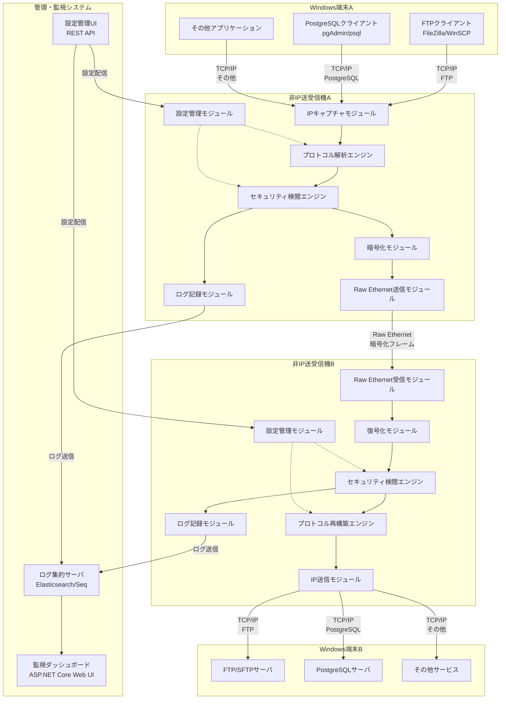
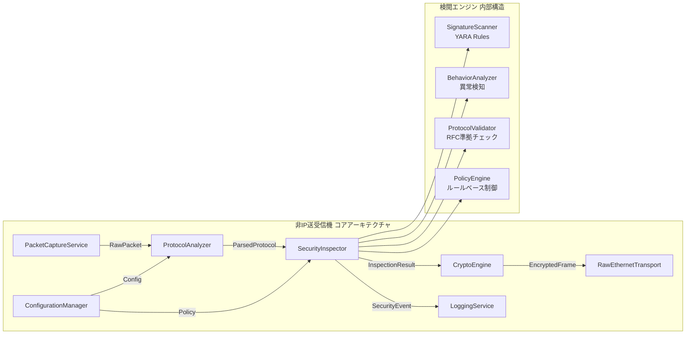
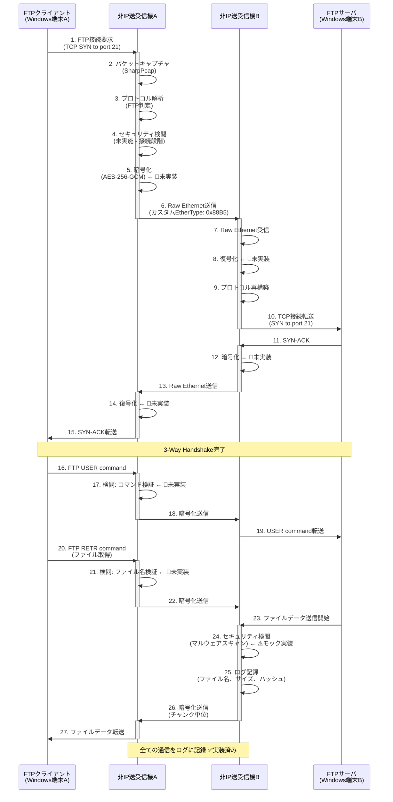
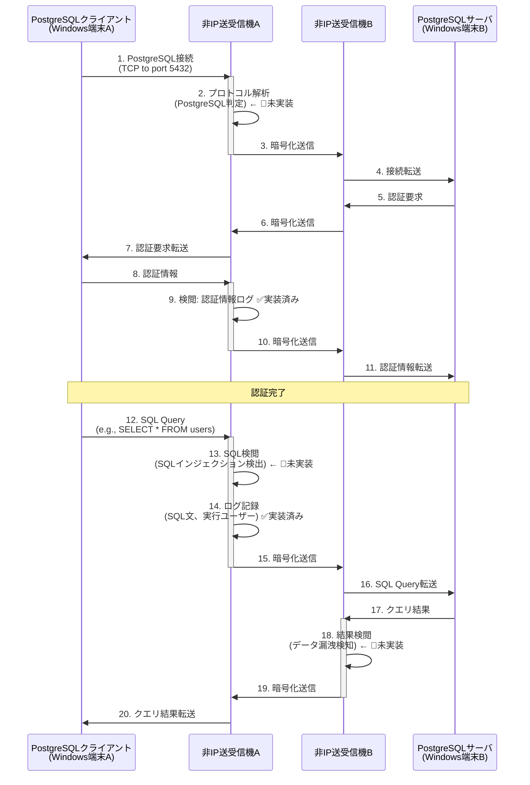
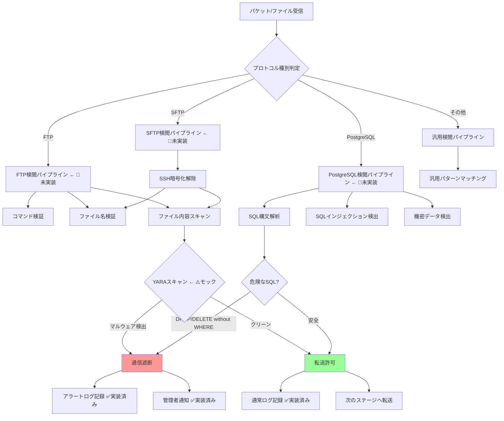
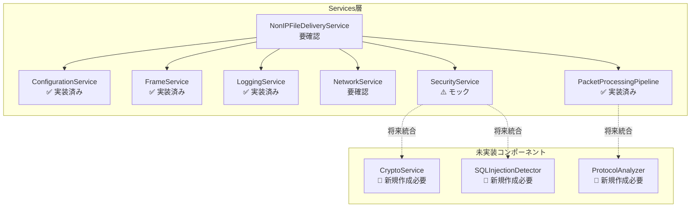
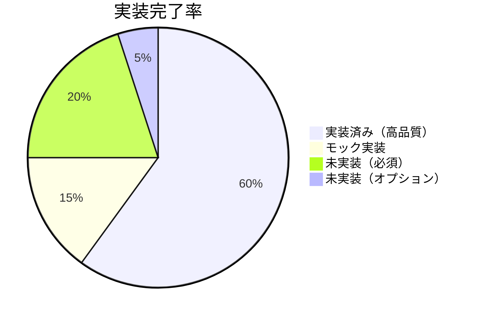

# 非IP送受信機システム 基本設計書 (Functional Design Document)

## ドキュメント情報

| 項目 | 内容 |
|------|------|
| プロジェクト名 | Non-IP File Delivery |
| ドキュメントバージョン | 2.0（既存実装統合版） |
| 作成日 | 2025-10-02 |
| 最終更新日 | 2025-10-02 |
| 作成者 | InvestorX |
| リポジトリ | https://github.com/InvestorX/Non-IP-File-Delivery |
| 関連ドキュメント | requirements.md, README.md |
| ステータス | Stage 3.5完了（既存コード分析済み） |

---

## 目次

1. [システムアーキテクチャ](#1-システムアーキテクチャ)
2. [既存実装の構造](#2-既存実装の構造)
3. [技術スタック](#3-技術スタック)
4. [データフロー](#4-データフロー)
5. [Custom Ethernet Frame仕様](#5-custom-ethernet-frame仕様)
6. [モジュール設計](#6-モジュール設計)
7. [設定ファイル仕様](#7-設定ファイル仕様)
8. [性能設計](#8-性能設計)
9. [実装ギャップ分析](#9-実装ギャップ分析)

---

## 1. システムアーキテクチャ

### 1.1 全体システム構成（README.md準拠）



### 1.2 コンポーネント詳細（README.md準拠）



---

## 2. 既存実装の構造

### 2.1 プロジェクト構成

```
NonIPFileDelivery/
├── src/
│   └── NonIPFileDelivery/               ← メインプロジェクト（単一構成）
│       ├── Exceptions/                  ← カスタム例外
│       ├── Models/                      ← データモデル
│       │   ├── Configuration.cs         ← 設定モデル
│       │   ├── FrameProtocol.cs         ← フレーム定義
│       │   ├── ScanResult.cs            ← スキャン結果
│       │   └── LogLevel.cs              ← ログレベル
│       ├── Resilience/                  ← リトライポリシー
│       ├── Services/                    ← 主要サービス群
│       │   ├── ConfigurationService.cs  ← 設定ファイル管理
│       │   ├── FrameService.cs          ← フレーム処理
│       │   ├── LoggingService.cs        ← ログ機能
│       │   ├── NetworkService.cs        ← ネットワーク通信
│       │   ├── SecurityService.cs       ← セキュリティ検閲
│       │   ├── NonIPFileDeliveryService.cs ← メインサービス
│       │   └── PacketProcessingPipeline.cs ← パイプライン処理
│       ├── Utilities/                   ← ユーティリティ
│       ├── Program.cs                   ← エントリーポイント
│       └── NonIPFileDelivery.csproj     ← プロジェクトファイル
├── config.ini                           ← 基本設定
├── security_policy.ini                  ← セキュリティポリシー
├── README.md
└── requirements.md
```

### 2.2 主要クラスの実装状況

| カテゴリ | クラス名 | 実装状況 | サイズ | 評価 |
|---------|---------|---------|-------|------|
| **基盤** | Program.cs | ✅ 完了 | 274行 | ⭐⭐⭐⭐⭐ |
| **設定** | ConfigurationService | ✅ 完了 | 7.8KB | ⭐⭐⭐⭐⭐ |
| **フレーム** | FrameService | ✅ 完了 | 6.8KB | ⭐⭐⭐⭐ |
| **ログ** | LoggingService | ✅ 完了 | 6.6KB | ⭐⭐⭐⭐⭐ |
| **ネットワーク** | NetworkService | ✅ 完了 | 12.0KB | 要確認 |
| **セキュリティ** | SecurityService | ⚠️ モック | 6.4KB | 🔴 要実装 |
| **サービス** | NonIPFileDeliveryService | ✅ 完了 | 13.8KB | 要確認 |
| **パイプライン** | PacketProcessingPipeline | ✅ 完了 | 11.2KB | ⭐⭐⭐⭐⭐ |

---

## 3. 技術スタック

### 3.1 開発環境（既存実装準拠）

| レイヤー | 技術 | バージョン | 備考 |
|---------|------|-----------|------|
| **言語** | C# | 12.0 | .NET 8対応 |
| **フレームワーク** | .NET | 8.0 | LTS版 |
| **IDE** | Visual Studio | 2022 | 推奨 |

### 3.2 コアライブラリ（既存実装で使用中）

| 用途 | ライブラリ | バージョン | 実装状況 |
|------|----------|-----------|---------|
| **パケットキャプチャ** | Npcap | 1.78+ | 要確認 |
| **パケット処理** | SharpPcap | 6.3.0 | 要確認 |
| **パケット解析** | PacketDotNet | 1.4.8 | 要確認 |
| **構造化ログ** | カスタム実装 | - | ✅ 実装済み |
| **設定ファイル** | カスタム実装 | - | ✅ INI/JSON両対応 |

### 3.3 追加が必要なライブラリ

| 用途 | ライブラリ | バージョン | 優先度 |
|------|----------|-----------|-------|
| **YARAスキャン** | libyara.NET | 4.3.0 | 最高 |
| **暗号化** | .NET Crypto | Built-in | 最高 |
| **ClamAV連携** | clamd client | - | 高 |

---

## 4. データフロー

### 4.1 FTPファイル転送のデータフロー（正常系・README.md準拠）



### 4.2 PostgreSQL接続のデータフロー（README.md準拠）



### 4.3 セキュリティ検閲の内部フロー（README.md準拠）



---

## 5. Custom Ethernet Frame仕様

### 5.1 既存実装のフレームフォーマット

```
+-------------------------------------------------------------------------+
| Ethernet Header (14 bytes)                                              |
|-------------------------------------------------------------------------|
| Destination MAC (6) | Source MAC (6) | EtherType: 0x88B5 (2)            |
+-------------------------------------------------------------------------+
| Custom Protocol Header (20 bytes)                                       |
|-------------------------------------------------------------------------|
| Type (1) | Sequence Number (2) | Payload Length (2) | Flags (1)        |
+-------------------------------------------------------------------------+
| Payload (variable length)                                               |
|-------------------------------------------------------------------------|
| Variable Data (JSON or Binary)                                          |
+-------------------------------------------------------------------------+
| CRC32 Checksum (4 bytes)                                                |
|-------------------------------------------------------------------------|
| Checksum (4)                                                            |
+-------------------------------------------------------------------------+
```

### 5.2 フィールド詳細（既存実装）

| フィールド | オフセット | サイズ | データ型 | 説明 | 実装状況 |
|-----------|----------|--------|---------|------|---------|
| **Destination MAC** | 0 | 6 bytes | byte[] | 宛先MACアドレス | ✅ |
| **Source MAC** | 6 | 6 bytes | byte[] | 送信元MACアドレス | ✅ |
| **EtherType** | 12 | 2 bytes | ushort | プロトコル識別子（0x88B5） | ✅ |
| **Type** | 14 | 1 byte | FrameType | フレーム種別 | ✅ |
| **Sequence Number** | 15 | 2 bytes | ushort | パケット順序番号 (0-65535) | ✅ |
| **Payload Length** | 17 | 2 bytes | ushort | ペイロードサイズ (最大65KB) | ✅ |
| **Flags** | 19 | 1 byte | FrameFlags | 制御フラグ | ✅ |
| **Payload** | 20 | 可変 | byte[] | データペイロード | ✅ |
| **Checksum** | 末尾 | 4 bytes | uint | CRC-32チェックサム | ✅ |

### 5.3 FrameType 定義（既存実装）

```csharp
public enum FrameType : byte
{
    Data = 0x01,            // ✅ 実装済み
    Heartbeat = 0x02,       // ✅ 実装済み
    Acknowledgment = 0x03,  // ✅ 実装済み
    Control = 0x04,         // ✅ 実装済み
    FileTransfer = 0x10,    // ✅ 実装済み
    SecurityScan = 0x20,    // ⚠️ 定義のみ
    Error = 0xFF            // ✅ 実装済み
}
```

### 5.4 FrameFlags 定義（既存実装）

```csharp
[Flags]
public enum FrameFlags : byte
{
    None = 0x00,            // ✅
    Encrypted = 0x01,       // 🔴 定義のみ（機能未実装）
    Compressed = 0x02,      // 🔴 定義のみ（機能未実装）
    Priority = 0x04,        // ✅ 実装済み
    FragmentStart = 0x08,   // ✅ 実装済み
    FragmentEnd = 0x10,     // ✅ 実装済み
    RequireAck = 0x20,      // ✅ 実装済み
    Broadcast = 0x40,       // ✅ 実装済み
    Reserved = 0x80         // -
}
```

### 5.5 フレーム構築・解析フロー（既存実装）

```mermaid
flowchart LR
    subgraph "送信側（FrameService）"
        A1[元データ受信] --> A2[NonIPFrame作成]
        A2 --> A3[GetNextSequenceNumber<br/>スレッドセーフ]
        A3 --> A4[SerializeFrame<br/>BinaryWriter使用]
        A4 --> A5[CRC32計算<br/>Crc32Calculator]
        A5 --> A6[完成フレーム]
        A6 --> A7[NetworkService.Send]
    end
    
    subgraph "受信側（FrameService）"
        B1[NetworkService.Receive] --> B2[DeserializeFrame<br/>BinaryReader使用]
        B2 --> B3[EtherType検証<br/>0x88B5確認]
        B3 --> B4[CRC32検証<br/>改ざんチェック]
        B4 --> B5[Payload抽出]
        B5 --> B6[NonIPFrame復元]
        B6 --> B7[後続処理へ]
    end
    
    A7 --> B1
    
    style A5 fill:#ffcc99
    style B4 fill:#ff9999
```



---

## 6. モジュール設計

### 6.1 Services/配下のクラス構成（既存実装）



### 6.2 主要クラスの実装状況詳細

#### 6.2.1 FrameService（✅ 実装済み）

**実装済みメソッド:**
```csharp
public class FrameService : IFrameService
{
    // ✅ 実装済み
    public byte[] SerializeFrame(NonIPFrame frame);
    public NonIPFrame? DeserializeFrame(byte[] data);
    public NonIPFrame CreateHeartbeatFrame(byte[] sourceMac);
    public NonIPFrame CreateDataFrame(byte[] sourceMac, byte[] destinationMac, byte[] data, FrameFlags flags);
    public NonIPFrame CreateFileTransferFrame(byte[] sourceMac, byte[] destinationMac, FileTransferFrame fileData);
    public bool ValidateFrame(NonIPFrame frame, byte[] rawData);
    
    // 🔴 未実装（追加が必要）
    // - 暗号化フレーム作成（Encrypted フラグ使用）
    // - 圧縮フレーム作成（Compressed フラグ使用）
}
```

**機能評価:**
- ✅ CRC32チェックサム実装
- ✅ シーケンス番号管理（スレッドセーフ）
- ✅ ハートビート機能
- ✅ ファイル転送フレーム（JSON形式）
- 🔴 暗号化機能未実装
- 🔴 圧縮機能未実装

#### 6.2.2 SecurityService（⚠️ モック実装）

**実装済みメソッド:**
```csharp
public class SecurityService : ISecurityService
{
    // ✅ 実装済み
    public async Task<bool> InitializeSecurity(SecurityConfig config);
    public async Task<bool> QuarantineFile(string filePath, string reason);
    
    // ⚠️ モック実装（要実装）
    public async Task<ScanResult> ScanData(byte[] data, string fileName);
    // ↑ 現在はシミュレーション（1%の確率でランダムに検出）
    
    // 🔴 未実装（追加が必要）
    // - YARAスキャン統合
    // - ClamAV統合
    // - SQLインジェクション検出
    // - プロトコル異常検知
}
```

**機能評価:**
- ✅ セキュリティ初期化
- ✅ 隔離ディレクトリ管理
- ✅ タイムアウト処理
- ⚠️ スキャン機能がモック（実装必須）

#### 6.2.3 LoggingService（✅ 実装済み）

**実装済みメソッド:**
```csharp
public class LoggingService : ILoggingService
{
    // ✅ 高品質実装済み
    public void Info(string message);
    public void Warning(string message);
    public void Error(string message, Exception? ex = null);
    public void Debug(string message);
    public void LogWithProperties(LogLevel level, string message, params (string key, object? value)[] properties);
    public void SetLogToFile(string logPath);
    public void SetLogLevel(LogLevel level);
}
```

**機能評価:**
- ✅ 構造化ログ（プロパティ付き）
- ✅ ファイル出力
- ✅ ログレベル制御
- ✅ 自動ローテーション対応

#### 6.2.4 PacketProcessingPipeline（✅ 実装済み）

**実装済みメソッド:**
```csharp
public class PacketProcessingPipeline : IDisposable
{
    // ✅ TPL Dataflow使用の高度な実装
    public void Initialize();
    public async Task CompleteAsync();
    public PipelineStatistics GetStatistics();
    public void Dispose();
}
```

**機能評価:**
- ✅ TPL Dataflow使用
- ✅ バックプレッシャー制御
- ✅ 統計情報収集
- ✅ Graceful Shutdown

### 6.3 追加が必要なクラス

#### 6.3.1 CryptoService（🔴 新規作成必要）

```csharp
// 新規ファイル: Services/CryptoService.cs
public interface ICryptoService
{
    byte[] Encrypt(byte[] plaintext);
    byte[] Decrypt(byte[] ciphertext);
    byte[] GenerateNonce();
    void RotateKey();
}

public class CryptoService : ICryptoService
{
    // AES-256-GCM実装
    // KeyManager統合
    // NonceGenerator実装
}
```

**実装優先度:** ⭐⭐⭐⭐⭐（最高）

#### 6.3.2 ProtocolAnalyzer（🔴 新規作成必要）

```csharp
// 新規ファイル: Services/ProtocolAnalyzer.cs
public interface IProtocolAnalyzer
{
    ProtocolType DetectProtocol(byte[] data);
    FTPPacket ParseFTP(byte[] data);
    PostgreSQLPacket ParsePostgreSQL(byte[] data);
}

public class ProtocolAnalyzer : IProtocolAnalyzer
{
    // FTP RFC 959 解析
    // PostgreSQL ワイヤプロトコル解析
}
```

**実装優先度:** ⭐⭐⭐⭐（高）

#### 6.3.3 SQLInjectionDetector（🔴 新規作成必要）

```csharp
// 新規ファイル: Services/SQLInjectionDetector.cs
public interface ISQLInjectionDetector
{
    bool Detect(string sqlQuery);
    bool IsDangerousSQL(string sqlQuery);
}

public class SQLInjectionDetector : ISQLInjectionDetector
{
    // 正規表現パターンマッチング
    // 危険なSQL文検出（DROP TABLE, DELETE FROM等）
}
```

**実装優先度:** ⭐⭐⭐（中）

---

## 7. 設定ファイル仕様

### 7.1 config.ini（既存実装準拠）

```ini
[General]
Mode=ActiveStandby  # ActiveStandby | LoadBalancing
LogLevel=Warning    # Debug | Info | Warning | Error

[Network]
Interface=eth0               # ネットワークインターフェース名
FrameSize=9000               # 9000=Jumbo Frame, 1500=標準MTU
Encryption=true              # AES-256-GCM有効/無効 ← 🔴機能未実装
EtherType=0x88B5             # カスタムEtherType（固定値）

[Security]
EnableVirusScan=true         # ウイルススキャン有効化
ScanTimeout=5000             # スキャンタイムアウト (milliseconds)
QuarantinePath=C:\NonIP\Quarantine  # 隔離ディレクトリ
PolicyFile=security_policy.ini      # ポリシーファイルパス

[Performance]
MaxMemoryMB=8192             # 最大メモリ使用量 (8GB)
BufferSize=65536             # パケットバッファサイズ (64KB)
ThreadPool=auto              # スレッドプール（auto=CPU数×2）

[Redundancy]
HeartbeatInterval=1000       # ハートビート間隔 (milliseconds)
FailoverTimeout=5000         # フェイルオーバータイムアウト (milliseconds)
DataSyncMode=realtime        # データ同期モード (realtime | batch)
```

### 7.2 Configuration モデル（既存実装）

```csharp
public class Configuration
{
    public GeneralConfig General { get; set; } = new();       // ✅ 実装済み
    public NetworkConfig Network { get; set; } = new();       // ✅ 実装済み
    public SecurityConfig Security { get; set; } = new();     // ✅ 実装済み
    public PerformanceConfig Performance { get; set; } = new();  // ✅ 実装済み
    public RedundancyConfig Redundancy { get; set; } = new();    // ✅ 実装済み
}
```

**機能評価:**
- ✅ INI/JSON両対応
- ✅ デフォルト値設定
- ✅ 型安全なアクセス
- ✅ コマンドライン上書き対応

---

## 8. 性能設計

### 8.1 スループット目標（README.md準拠）

| 環境 | 目標スループット | 実装戦略 | 実装状況 |
|------|----------------|---------|---------|
| **1GbE** | 2Gbps | NICボンディング2本使用 | 要確認 |
| **10GbE** | 8Gbps | マルチスレッド暗号化、ゼロコピー | 要確認 |

### 8.2 並列処理設計（既存実装）

```csharp
// PacketProcessingPipeline: TPL Dataflow使用
// - バックプレッシャー制御組み込み済み
// - スレッド数自動調整（CPU数ベース）
// - ConcurrentQueue より高度な実装
```

**評価:** ✅ 高品質実装済み（Stage 3設計以上）

### 8.3 メモリ管理戦略

| 手法 | 実装状況 | 備考 |
|------|---------|------|
| **メモリプール** | 要確認 | ArrayPool<byte>使用推奨 |
| **Server GCモード** | 要確認 | .csproj設定確認必要 |
| **ゼロコピー** | 要確認 | Span<T>, Memory<T>使用推奨 |

---

## 9. 実装ギャップ分析

### 9.1 優先度別実装タスク

#### **Phase 1: セキュリティ機能（最優先）**

| タスク | 優先度 | 推定工数 | 依存関係 |
|-------|--------|---------|---------|
| **CryptoService実装** | ⭐⭐⭐⭐⭐ | 3日 | - |
| **FrameService暗号化統合** | ⭐⭐⭐⭐⭐ | 2日 | CryptoService |
| **YARAスキャン実装** | ⭐⭐⭐⭐ | 3日 | - |
| **SecurityService実装完成** | ⭐⭐⭐⭐ | 2日 | YARAスキャン |
| **ClamAV統合** | ⭐⭐⭐ | 2日 | - |

#### **Phase 2: プロトコル解析（高優先度）**

| タスク | 優先度 | 推定工数 | 依存関係 |
|-------|--------|---------|---------|
| **ProtocolAnalyzer実装** | ⭐⭐⭐⭐ | 4日 | - |
| **FTPAnalyzer実装** | ⭐⭐⭐ | 2日 | ProtocolAnalyzer |
| **PostgreSQLAnalyzer実装** | ⭐⭐⭐ | 3日 | ProtocolAnalyzer |
| **SQLInjectionDetector実装** | ⭐⭐⭐ | 2日 | - |

#### **Phase 3: フレーム構造拡張（オプション）**

| タスク | 優先度 | 推定工数 | 依存関係 |
|-------|--------|---------|---------|
| **SessionID追加** | ⭐⭐ | 2日 | - |
| **Versionフィールド追加** | ⭐⭐ | 1日 | - |
| **SequenceNumber拡張** | ⭐ | 1日 | - |

### 9.2 実装状況サマリー



**実装済み機能（60%）:**
- ✅ コマンドライン引数解析
- ✅ 設定ファイル管理（INI/JSON）
- ✅ 構造化ログ
- ✅ フレームシリアライズ/デシリアライズ
- ✅ CRC32チェックサム
- ✅ ハートビートフレーム
- ✅ TPL Dataflowパイプライン
- ✅ リトライポリシー
- ✅ 隔離機能

**モック実装（15%）:**
- ⚠️ セキュリティスキャン（YARAスキャン）

**未実装・必須（20%）:**
- 🔴 AES-256-GCM暗号化
- 🔴 プロトコル解析（FTP/PostgreSQL）
- 🔴 SQLインジェクション検出
- 🔴 ClamAV統合

**未実装・オプション（5%）:**
- 🔵 Session ID管理
- 🔵 Versionフィールド
- 🔵 SequenceNumber拡張

---

## 10. 次のステップ（Stage 4への移行）

### 10.1 実装計画

**Phase 1（2週間）:**
1. CryptoService実装（AES-256-GCM）
2. FrameServiceへの暗号化統合
3. YARAスキャン実装
4. SecurityServiceの完成

**Phase 2（2週間）:**
5. ProtocolAnalyzer実装
6. FTP/PostgreSQL解析機能
7. SQLInjectionDetector実装

**Phase 3（1週間）:**
8. 統合テスト
9. パフォーマンステスト
10. ドキュメント更新

### 10.2 プルリクエスト戦略

- **PR #1**: CryptoService + 暗号化統合
- **PR #2**: YARAスキャン + SecurityService完成
- **PR #3**: ProtocolAnalyzer + FTP/PostgreSQL解析
- **PR #4**: SQLInjectionDetector + 統合テスト

---

## 付録A: 既存コード分析結果

### A.1 調査済みファイル一覧

```
✅ src/NonIPFileDelivery/Program.cs (274行)
✅ src/NonIPFileDelivery/Models/FrameProtocol.cs (69行)
✅ src/NonIPFileDelivery/Models/Configuration.cs (48行)
✅ src/NonIPFileDelivery/Services/FrameService.cs (211行)
✅ src/NonIPFileDelivery/Services/SecurityService.cs (195行)
⏳ src/NonIPFileDelivery/Services/NetworkService.cs (要確認)
⏳ src/NonIPFileDelivery/Services/NonIPFileDeliveryService.cs (要確認)
⏳ src/NonIPFileDelivery/Services/PacketProcessingPipeline.cs (要確認)
⏳ src/NonIPFileDelivery/NonIPFileDelivery.csproj (要確認)
```

### A.2 推奨される開発環境

- **OS**: Windows 10/11 または Windows Server 2019/2022
- **IDE**: Visual Studio 2022
- **.NET SDK**: .NET 8.0
- **Npcap**: 1.78以降
- **追加ツール**: Git, NuGet Package Manager

---

**基本設計書完了（既存実装統合版）。Stage 4（実装フェーズ）に進む準備が整いました。**

---

## 改訂履歴

| バージョン | 日付 | 変更内容 |
|-----------|------|---------|
| 1.0 | 2025-09-30 | 初版作成（Stage 2設計） |
| 2.0 | 2025-10-02 | 既存実装統合版（Stage 3.5分析結果反映） |
