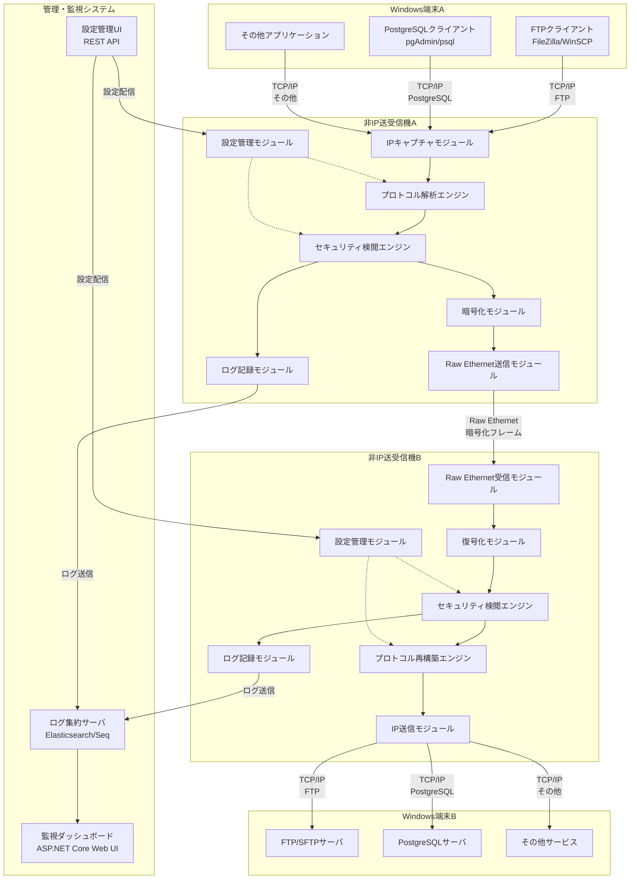
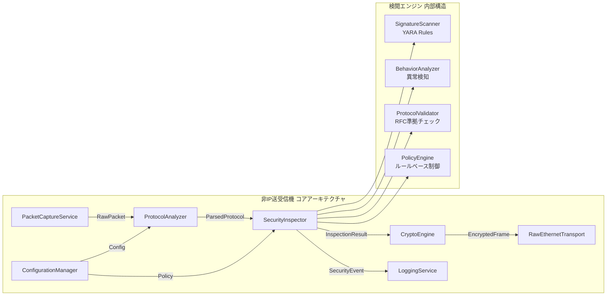
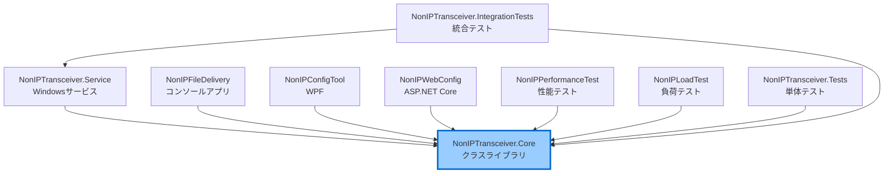
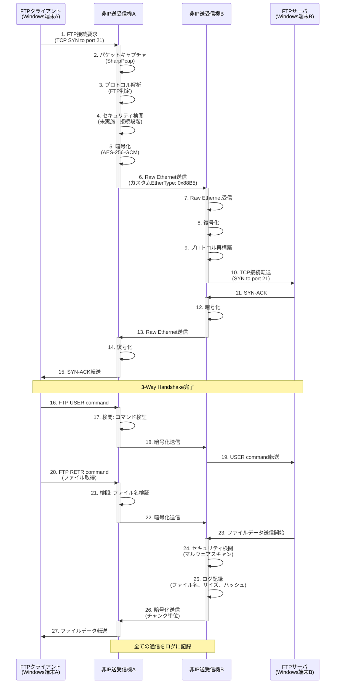
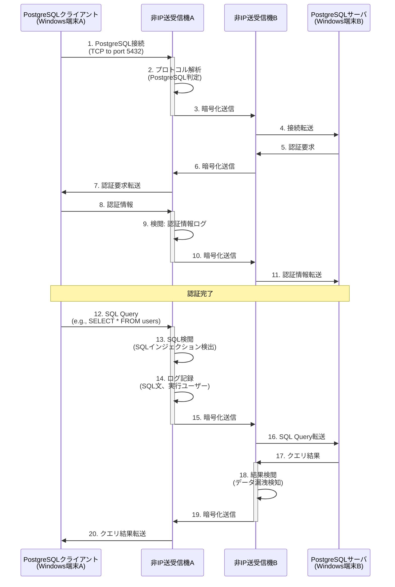
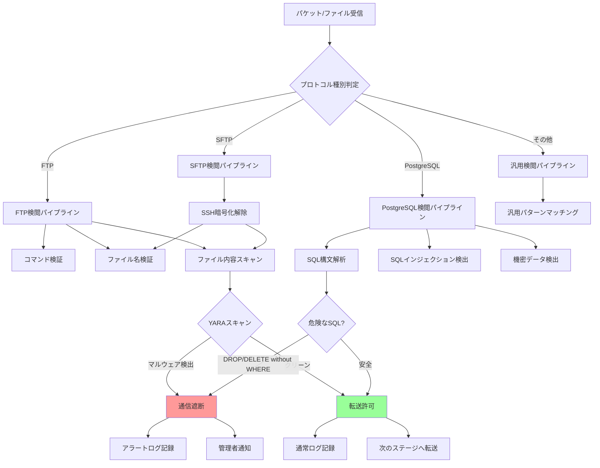
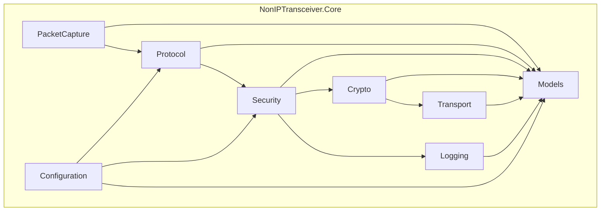
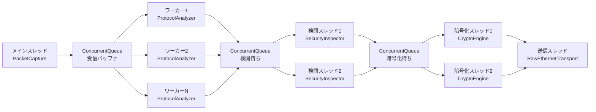

# 非IP送受信機システム 基本設計書 (Functional Design Document)

## ドキュメント情報

| 項目 | 内容 |
|------|------|
| プロジェクト名 | Non-IP File Delivery |
| ドキュメントバージョン | 2.0 |
| 作成日 | 2025-09-30 |
| 最終更新日 | 2025-09-30 |
| 作成者 | InvestorX |
| リポジトリ | https://github.com/InvestorX/Non-IP-File-Delivery |
| 関連ドキュメント | requirements.md, README.md |
| ステータス | Stage 2完了、レビュー待ち |

---

## 目次

1. [システムアーキテクチャ](#1-システムアーキテクチャ)
2. [プロジェクト構造](#2-プロジェクト構造)
3. [技術スタック](#3-技術スタック)
4. [データフロー](#4-データフロー)
5. [Custom Ethernet Frame仕様](#5-custom-ethernet-frame仕様)
6. [モジュール設計](#6-モジュール設計)
7. [設定ファイル仕様](#7-設定ファイル仕様)
8. [性能設計](#8-性能設計)
9. [エラーハンドリング戦略](#9-エラーハンドリング戦略)
10. [セキュリティ設計](#10-セキュリティ設計)

---

## 1. システムアーキテクチャ

### 1.1 全体システム構成



### 1.2 コンポーネント詳細



### 1.3 コンポーネント責務定義

| コンポーネント | 責務 | 主要クラス | 実装プロジェクト |
|-------------|------|----------|---------------|
| **PacketCaptureService** | Windows端末AからのTCP/IPパケットキャプチャ | `PacketCaptureService`<br/>`SharpPcapWrapper` | NonIPTransceiver.Core |
| **ProtocolAnalyzer** | キャプチャしたパケットのプロトコル判定と解析 | `ProtocolDetector`<br/>`FTPAnalyzer`<br/>`PostgreSQLAnalyzer` | NonIPTransceiver.Core |
| **SecurityInspector** | セキュリティ検閲の実行と判定 | `InspectionOrchestrator`<br/>`YARAScanner`<br/>`SQLInjectionDetector` | NonIPTransceiver.Core |
| **CryptoEngine** | AES-256-GCMによる暗号化・復号化 | `AESGCMEngine`<br/>`KeyManager` | NonIPTransceiver.Core |
| **RawEthernetTransport** | 独自フレームのRaw Ethernet送受信 | `RawEthernetTransport`<br/>`FrameBuilder`<br/>`FrameParser` | NonIPTransceiver.Core |
| **LoggingService** | 構造化ログの記録と送信 | `StructuredLogger`<br/>`SyslogSender` | NonIPTransceiver.Core |
| **ConfigurationManager** | 設定ファイルの読み込みとホットリロード | `ConfigLoader`<br/>`PolicyLoader` | NonIPTransceiver.Core |

---

## 2. プロジェクト構造

### 2.1 Visual Studio ソリューション構成

```
NonIPFileDelivery.sln
│
├── src/
│   ├── NonIPTransceiver.Core/           ← 【新規追加】コアライブラリ
│   │   ├── PacketCapture/
│   │   │   ├── PacketCaptureService.cs
│   │   │   ├── SharpPcapWrapper.cs
│   │   │   └── PacketCaptureEventArgs.cs
│   │   ├── Protocol/
│   │   │   ├── ProtocolDetector.cs
│   │   │   ├── FTPAnalyzer.cs
│   │   │   ├── SFTPAnalyzer.cs
│   │   │   ├── PostgreSQLAnalyzer.cs
│   │   │   └── GenericAnalyzer.cs
│   │   ├── Security/
│   │   │   ├── SecurityInspector.cs
│   │   │   ├── YARAScanner.cs
│   │   │   ├── ClamAVScanner.cs
│   │   │   ├── SQLInjectionDetector.cs
│   │   │   ├── BehaviorAnalyzer.cs
│   │   │   └── PolicyEngine.cs
│   │   ├── Crypto/
│   │   │   ├── AESGCMEngine.cs
│   │   │   ├── KeyManager.cs
│   │   │   └── NonceGenerator.cs
│   │   ├── Transport/
│   │   │   ├── RawEthernetTransport.cs
│   │   │   ├── FrameBuilder.cs
│   │   │   ├── FrameParser.cs
│   │   │   ├── CustomFrame.cs
│   │   │   └── SequenceManager.cs
│   │   ├── Logging/
│   │   │   ├── StructuredLogger.cs
│   │   │   ├── SyslogSender.cs
│   │   │   └── LogEvent.cs
│   │   ├── Configuration/
│   │   │   ├── ConfigurationManager.cs
│   │   │   ├── PolicyLoader.cs
│   │   │   └── TransceiverConfig.cs
│   │   ├── Models/
│   │   │   ├── Session.cs
│   │   │   ├── InspectionResult.cs
│   │   │   ├── ParsedPacket.cs
│   │   │   └── ProtocolType.cs
│   │   └── NonIPTransceiver.Core.csproj
│   │
│   ├── NonIPTransceiver.Service/        ← 【新規追加】Windowsサービス
│   │   ├── Program.cs
│   │   ├── Worker.cs
│   │   ├── appsettings.json
│   │   └── NonIPTransceiver.Service.csproj
│   │
│   ├── NonIPFileDelivery/               ← 既存プロジェクト（コンソールアプリ）
│   │   ├── Program.cs
│   │   └── NonIPFileDelivery.csproj
│   │
│   ├── NonIPConfigTool/                 ← 既存プロジェクト（WPF設定ツール）
│   │   ├── MainWindow.xaml
│   │   ├── MainWindow.xaml.cs
│   │   ├── ViewModels/
│   │   │   ├── ConfigViewModel.cs
│   │   │   └── SecurityPolicyViewModel.cs
│   │   ├── Models/
│   │   └── NonIPConfigTool.csproj
│   │
│   ├── NonIPWebConfig/                  ← 既存プロジェクト（Web設定ツール）
│   │   ├── Controllers/
│   │   │   ├── ConfigController.cs
│   │   │   └── MonitoringController.cs
│   │   ├── Pages/
│   │   │   ├── Index.cshtml
│   │   │   └── Settings.cshtml
│   │   ├── wwwroot/
│   │   │   ├── css/
│   │   │   └── js/dashboard.js
│   │   └── NonIPWebConfig.csproj
│   │
│   ├── NonIPPerformanceTest/            ← 既存プロジェクト（性能テスト）
│   │   ├── ThroughputTest.cs
│   │   ├── LatencyTest.cs
│   │   └── NonIPPerformanceTest.csproj
│   │
│   └── NonIPLoadTest/                   ← 既存プロジェクト（負荷テスト）
│       ├── ConcurrentConnectionTest.cs
│       ├── StressTest.cs
│       └── NonIPLoadTest.csproj
│
├── tests/                               ← 【新規追加】テストプロジェクト
│   ├── NonIPTransceiver.Tests/
│   │   ├── PacketCapture/
│   │   │   └── PacketCaptureServiceTests.cs
│   │   ├── Protocol/
│   │   │   ├── FTPAnalyzerTests.cs
│   │   │   └── PostgreSQLAnalyzerTests.cs
│   │   ├── Security/
│   │   │   ├── YARAScannerTests.cs
│   │   │   └── SQLInjectionDetectorTests.cs
│   │   ├── Crypto/
│   │   │   └── AESGCMEngineTests.cs
│   │   ├── Transport/
│   │   │   ├── FrameBuilderTests.cs
│   │   │   └── FrameParserTests.cs
│   │   └── NonIPTransceiver.Tests.csproj
│   │
│   └── NonIPTransceiver.IntegrationTests/
│       ├── EndToEndTests.cs
│       ├── FTPTransferTests.cs
│       ├── PostgreSQLConnectionTests.cs
│       └── NonIPTransceiver.IntegrationTests.csproj
│
├── docs/                                ← 既存ディレクトリ
│   ├── functionaldesign.md              ← 本ドキュメント
│   ├── technical-specification.md       ← 【Stage 3で作成予定】
│   ├── api-reference.md                 ← 【Stage 3で作成予定】
│   └── configuration-guide.md           ← 【Stage 4で作成予定】
│
├── config.ini                           ← 既存ファイル
├── security_policy.ini                  ← 既存ファイル
├── README.md                            ← 既存ファイル
├── requirements.md                      ← 既存ファイル
└── .gitignore                           ← 既存ファイル
```

### 2.2 プロジェクト依存関係



---

## 3. 技術スタック

### 3.1 開発環境

| レイヤー | 技術 | バージョン | 選定理由 |
|---------|------|-----------|---------|
| **プログラミング言語** | C# | 12.0 | .NET 8対応、リポジトリ100% C# |
| **フレームワーク** | .NET | 8.0 | LTS、Windows最適化、高性能 |
| **IDE** | Visual Studio | 2022 | 既存.slnファイル対応、デバッガ充実 |
| **ビルドツール** | MSBuild / dotnet CLI | 17.0+ | .NET標準ツール |
| **パッケージ管理** | NuGet | 6.0+ | .NETエコシステム標準 |

### 3.2 コアライブラリ

| 用途 | ライブラリ | NuGetパッケージ | バージョン | 機能 |
|------|----------|---------------|-----------|------|
| **パケットキャプチャ** | Npcap | - | 1.78+ | Windowsカーネルドライバ（外部インストール） |
| **パケット処理** | SharpPcap | `SharpPcap` | 6.3.0 | NpcapのC#ラッパー |
| **パケット解析** | PacketDotNet | `PacketDotNet` | 1.4.8 | Ethernet/IP/TCPヘッダ解析 |
| **暗号化** | .NET Crypto | `System.Security.Cryptography` | Built-in | AES-256-GCM実装 |
| **YARAスキャン** | libyara.NET | `libyara.NET` | 4.3.0 | マルウェアシグネチャスキャン |
| **構造化ログ** | Serilog | `Serilog`<br/>`Serilog.Sinks.File`<br/>`Serilog.Sinks.Elasticsearch` | 3.1.1 | JSON/Syslogログ出力 |
| **設定ファイル** | INI Parser | `ini-parser` | 2.5.2 | config.ini読み込み |
| **依存性注入** | Microsoft DI | `Microsoft.Extensions.DependencyInjection` | 8.0.0 | DIコンテナ |

### 3.3 プロジェクト別パッケージ構成

#### NonIPTransceiver.Core.csproj

```xml
<Project Sdk="Microsoft.NET.Sdk">
  <PropertyGroup>
    <TargetFramework>net8.0</TargetFramework>
    <ImplicitUsings>enable</ImplicitUsings>
    <Nullable>enable</Nullable>
    <LangVersion>12.0</LangVersion>
  </PropertyGroup>

  <ItemGroup>
    <!-- パケットキャプチャ -->
    <PackageReference Include="SharpPcap" Version="6.3.0" />
    <PackageReference Include="PacketDotNet" Version="1.4.8" />
    
    <!-- セキュリティ -->
    <PackageReference Include="libyara.NET" Version="4.3.0" />
    
    <!-- ログ -->
    <PackageReference Include="Serilog" Version="3.1.1" />
    <PackageReference Include="Serilog.Sinks.File" Version="5.0.0" />
    <PackageReference Include="Serilog.Sinks.Elasticsearch" Version="9.0.3" />
    
    <!-- 設定 -->
    <PackageReference Include="ini-parser" Version="2.5.2" />
    
    <!-- DI -->
    <PackageReference Include="Microsoft.Extensions.DependencyInjection" Version="8.0.0" />
    <PackageReference Include="Microsoft.Extensions.Logging" Version="8.0.0" />
  </ItemGroup>
</Project>
```

#### NonIPTransceiver.Service.csproj

```xml
<Project Sdk="Microsoft.NET.Sdk.Worker">
  <PropertyGroup>
    <TargetFramework>net8.0</TargetFramework>
    <OutputType>Exe</OutputType>
    <ImplicitUsings>enable</ImplicitUsings>
    <Nullable>enable</Nullable>
  </PropertyGroup>

  <ItemGroup>
    <PackageReference Include="Microsoft.Extensions.Hosting" Version="8.0.0" />
    <PackageReference Include="Microsoft.Extensions.Hosting.WindowsServices" Version="8.0.0" />
  </ItemGroup>

  <ItemGroup>
    <ProjectReference Include="..\NonIPTransceiver.Core\NonIPTransceiver.Core.csproj" />
  </ItemGroup>
</Project>
```

#### NonIPConfigTool.csproj

```xml
<Project Sdk="Microsoft.NET.Sdk">
  <PropertyGroup>
    <OutputType>WinExe</OutputType>
    <TargetFramework>net8.0-windows</TargetFramework>
    <UseWPF>true</UseWPF>
    <ImplicitUsings>enable</ImplicitUsings>
    <Nullable>enable</Nullable>
  </PropertyGroup>

  <ItemGroup>
    <ProjectReference Include="..\NonIPTransceiver.Core\NonIPTransceiver.Core.csproj" />
  </ItemGroup>
</Project>
```

#### NonIPWebConfig.csproj

```xml
<Project Sdk="Microsoft.NET.Sdk.Web">
  <PropertyGroup>
    <TargetFramework>net8.0</TargetFramework>
    <ImplicitUsings>enable</ImplicitUsings>
    <Nullable>enable</Nullable>
  </PropertyGroup>

  <ItemGroup>
    <PackageReference Include="Microsoft.AspNetCore.Mvc" Version="2.2.0" />
    <PackageReference Include="Swashbuckle.AspNetCore" Version="6.5.0" />
  </ItemGroup>

  <ItemGroup>
    <ProjectReference Include="..\NonIPTransceiver.Core\NonIPTransceiver.Core.csproj" />
  </ItemGroup>
</Project>
```

---

## 4. データフロー

### 4.1 FTPファイル転送のデータフロー（正常系）



#### データフロー詳細補足

| ステップ | 処理内容 | 使用コンポーネント | 処理時間目標 |
|---------|---------|------------------|------------|
| 2 | パケットキャプチャ | `PacketCaptureService.OnPacketArrival()` | <1ms |
| 3 | プロトコル解析 | `ProtocolDetector.Detect()` (Port 21判定) | <0.5ms |
| 5 | AES-256-GCM暗号化 | `CryptoEngine.Encrypt()` | <2ms |
| 6 | Raw Ethernet送信 | `RawEthernetTransport.Send()` | <1ms |
| 8 | 復号化 | `CryptoEngine.Decrypt()` | <2ms |
| 17 | コマンド検証 | `FTPAnalyzer.ValidateCommand()` | <0.5ms |
| 24 | マルウェアスキャン | `YARAScanner.Scan()` | <5000ms (最大) |
| 25 | ログ記録 | `LoggingService.LogTransfer()` | <1ms |

### 4.2 PostgreSQL接続のデータフロー



#### PostgreSQL処理詳細

| ステップ | 処理内容 | 使用コンポーネント | 処理時間目標 |
|---------|---------|------------------|------------|
| 2 | プロトコル解析 | `ProtocolDetector.Detect()` (Port 5432判定) | <0.5ms |
| 9 | 認証情報ログ | `LoggingService.LogAuth()` (パスワードマスク) | <1ms |
| 13 | SQLインジェクション検出 | `SQLInjectionDetector.Analyze()` | <3ms |
| 14 | SQL文ログ記録 | `LoggingService.LogQuery()` | <1ms |
| 18 | データ漏洩検知 | `DataLeakageDetector.Scan()` | <5ms |

### 4.3 セキュリティ検閲の内部フロー



#### 検閲エンジン実装マッピング

| 検閲種別 | 実装クラス | 検査内容 | タイムアウト |
|---------|----------|---------|------------|
| **FTPコマンド検証** | `FTPCommandValidator` | 許可コマンドリスト確認 | 即時 |
| **ファイル名検証** | `FileNameValidator` | 拡張子・パターンマッチング | 即時 |
| **YARAスキャン** | `YARAScanner` | マルウェアシグネチャ検索 | 5000ms |
| **SQLインジェクション検出** | `SQLInjectionDetector` | 危険パターン検出 | 3ms |
| **機密データ検出** | `SensitiveDataDetector` | クレジットカード番号等 | 5ms |
| **汎用パターンマッチング** | `PatternMatcher` | カスタムルール適用 | 10ms |

---

## 5. Custom Ethernet Frame仕様

### 5.1 フレームフォーマット

```
+-------------------------------------------------------------------------+
| Ethernet Header (14 bytes)                                              |
|-------------------------------------------------------------------------|
| Destination MAC (6) | Source MAC (6) | EtherType: 0x88B5 (2)            |
+-------------------------------------------------------------------------+
| Custom Protocol Header (32 bytes)                                       |
|-------------------------------------------------------------------------|
| Version (1) | Flags (1) | Sequence Number (4) | Session ID (16)         |
| Payload Length (4) | Checksum (4) | Reserved (2)                       |
+-------------------------------------------------------------------------+
| Encrypted Payload (variable length)                                     |
|-------------------------------------------------------------------------|
| AES-GCM Encrypted Data                                                  |
|   - Original IP Packet (variable)                                       |
|   - Authentication Tag (16 bytes)                                       |
+-------------------------------------------------------------------------+
```

### 5.2 フィールド詳細定義

| フィールド | オフセット | サイズ | データ型 | 説明 | 値の範囲 |
|-----------|----------|--------|---------|------|---------|
| **Destination MAC** | 0 | 6 bytes | byte[] | 宛先MACアドレス | 非IP送受信機A/BのMAC |
| **Source MAC** | 6 | 6 bytes | byte[] | 送信元MACアドレス | 非IP送受信機A/BのMAC |
| **EtherType** | 12 | 2 bytes | ushort | プロトコル識別子 | **0x88B5** (固定値) |
| **Version** | 14 | 1 byte | byte | プロトコルバージョン | **0x01** (Version 1) |
| **Flags** | 15 | 1 byte | byte | 制御フラグ (ビットフィールド) | 下記参照 |
| **Sequence Number** | 16 | 4 bytes | uint | パケット順序番号 | 0 - 0xFFFFFFFF |
| **Session ID** | 20 | 16 bytes | Guid | セッション識別子 | UUID v4 (RFC 4122) |
| **Payload Length** | 36 | 4 bytes | uint | 暗号化ペイロードサイズ | 0 - 8916 bytes |
| **Checksum** | 40 | 4 bytes | uint | ヘッダCRC-32 | CRC-32/ISO-HDLC |
| **Reserved** | 44 | 2 bytes | ushort | 将来の拡張用 | **0x0000** |
| **Encrypted Data** | 46 | 可変 | byte[] | AES-GCM暗号化データ | 元IPパケット + 認証タグ(16) |

### 5.3 Flagsビットフィールド定義

```
Bit Position: 7 6 5 4 3 2 1 0
              | | | | | | | |
              | | | | | | | +-- [0] Fragment (0=完全パケット, 1=フラグメント)
              | | | | | | +---- [1] Last Fragment (1=最終フラグメント)
              | | | | | +------ [2] ACK Required (1=ACK必須)
              | | | | +-------- [3] Priority (1=高優先度)
              | | | +---------- [4] Reserved
              | | +------------ [5] Reserved
              | +-------------- [6] Reserved
              +---------------- [7] Reserved
```

**Flagsの使用例:**

| 値 (Hex) | ビット表現 | 意味 |
|---------|----------|------|
| 0x00 | 0000 0000 | 通常パケット（フラグメント無し） |
| 0x01 | 0000 0001 | フラグメント（中間） |
| 0x03 | 0000 0011 | 最終フラグメント |
| 0x04 | 0000 0100 | ACK必須パケット |
| 0x08 | 0000 1000 | 高優先度パケット |

### 5.4 フレーム構築・解析フロー

```mermaid
flowchart LR
    subgraph "送信側 (非IP送受信機A)"
        A1[元のIPパケット受信] --> A2[Session ID生成/取得<br/>UUID v4]
        A2 --> A3[Sequence Number割り当て<br/>セッション毎に管理]
        A3 --> A4[AES-256-GCM暗号化<br/>256-bit鍵使用]
        A4 --> A5[Authentication Tag付加<br/>16 bytes]
        A5 --> A6[Custom Header構築<br/>32 bytes]
        A6 --> A7[Checksum計算<br/>CRC-32/ISO-HDLC]
        A7 --> A8[Ethernet Header追加<br/>14 bytes]
        A8 --> A9[完成フレーム<br/>46 + Payload bytes]
        A9 --> A10[SharpPcap.SendPacket]
    end
    
    subgraph "受信側 (非IP送受信機B)"
        B1[SharpPcap.OnPacketArrival] --> B2[Ethernet Header検証<br/>EtherType == 0x88B5]
        B2 --> B3[Checksum検証<br/>CRC-32計算]
        B3 --> B4[Custom Header解析<br/>32 bytes読み取り]
        B4 --> B5[Session ID確認<br/>セッションテーブル検索]
        B5 --> B6[Sequence Number検証<br/>順序確認]
        B6 --> B7[AES-GCM復号化<br/>同一鍵使用]
        B7 --> B8[Authentication Tag検証<br/>改ざん検知]
        B8 --> B9[元のIPパケット復元]
        B9 --> B10[Windows TCP/IP Stackへ送信]
    end
    
    A10 --> B1
    
    style A4 fill:#99ccff
    style A7 fill:#ffcc99
    style B3 fill:#ffcc99
    style B7 fill:#99ccff
    style B8 fill:#ff9999
```



### 5.5 フレームサイズ計算

```
最小フレームサイズ:
  Ethernet Header:     14 bytes
  Custom Header:       32 bytes
  Encrypted Payload:   20 bytes (最小IPパケット) + 16 bytes (Auth Tag)
  = 82 bytes

最大フレームサイズ (標準MTU 1500):
  Ethernet Header:     14 bytes
  Custom Header:       32 bytes
  Encrypted Payload:   1454 bytes (元IPパケット 1438 + Auth Tag 16)
  = 1500 bytes

最大フレームサイズ (Jumbo Frame 9000):
  Ethernet Header:     14 bytes
  Custom Header:       32 bytes
  Encrypted Payload:   8954 bytes (元IPパケット 8938 + Auth Tag 16)
  = 9000 bytes
```

---

## 6. モジュール設計

### 6.1 NonIPTransceiver.Core モジュール構成



### 6.2 主要クラス一覧

#### 6.2.1 PacketCapture 名前空間

| クラス名 | 責務 | 主要メソッド |
|---------|------|------------|
| **PacketCaptureService** | SharpPcapによるパケットキャプチャ | `StartCapture(string interfaceName)`<br/>`StopCapture()`<br/>`OnPacketArrival(object sender, PacketCapture e)` |
| **SharpPcapWrapper** | SharpPcapライブラリのラッパー | `GetDevices()`<br/>`OpenDevice(string name)`<br/>`SetFilter(string filter)` |
| **PacketCaptureEventArgs** | パケット到着イベント引数 | `RawCapture Packet { get; }`<br/>`DateTime Timestamp { get; }` |

**PacketCaptureService.cs 概要:**

```csharp
namespace NonIPTransceiver.Core.PacketCapture
{
    /// <summary>
    /// パケットキャプチャサービス
    /// SharpPcapを使用してWindows端末Aからのパケットをキャプチャ
    /// </summary>
    public class PacketCaptureService : IDisposable
    {
        private readonly ILogger<PacketCaptureService> _logger;
        private ICaptureDevice? _device;
        
        /// <summary>
        /// パケット到着時のイベント
        /// </summary>
        public event EventHandler<PacketCaptureEventArgs>? PacketArrived;
        
        /// <summary>
        /// キャプチャ開始
        /// </summary>
        /// <param name="interfaceName">ネットワークインターフェース名 (config.ini [Network]Interface)</param>
        public void StartCapture(string interfaceName)
        {
            // 1. デバイス検索
            // 2. Promiscuousモード有効化
            // 3. フィルター設定 (tcp port 21 or tcp port 22 or tcp port 5432)
            // 4. OnPacketArrivalイベント登録
            // 5. キャプチャ開始
        }
        
        /// <summary>
        /// キャプチャ停止
        /// </summary>
        public void StopCapture()
        {
            // デバイスクローズ処理
        }
        
        private void OnPacketArrival(object sender, PacketCapture e)
        {
            // PacketArrivedイベント発火
        }
        
        public void Dispose()
        {
            StopCapture();
        }
    }
}
```

#### 6.2.2 Protocol 名前空間

| クラス名 | 責務 | 主要メソッド |
|---------|------|------------|
| **ProtocolDetector** | プロトコル種別判定 | `ProtocolType Detect(RawCapture packet)` |
| **FTPAnalyzer** | FTPプロトコル解析 | `FTPPacket Parse(RawCapture packet)`<br/>`bool ValidateCommand(string command)` |
| **SFTPAnalyzer** | SFTPプロトコル解析 | `SFTPPacket Parse(RawCapture packet)` |
| **PostgreSQLAnalyzer** | PostgreSQLプロトコル解析 | `PostgreSQLPacket Parse(RawCapture packet)`<br/>`string ExtractSQL(PostgreSQLPacket packet)` |
| **GenericAnalyzer** | 汎用プロトコル解析 | `GenericPacket Parse(RawCapture packet)` |

**ProtocolDetector.cs 概要:**

```csharp
namespace NonIPTransceiver.Core.Protocol
{
    /// <summary>
    /// プロトコル検出器
    /// TCPポート番号からプロトコル種別を判定
    /// </summary>
    public class ProtocolDetector
    {
        private readonly ILogger<ProtocolDetector> _logger;
        
        /// <summary>
        /// プロトコル種別を判定
        /// </summary>
        /// <param name="packet">生パケット</param>
        /// <returns>プロトコル種別</returns>
        public ProtocolType Detect(RawCapture packet)
        {
            // PacketDotNetでTCPポート抽出
            // 21 -> FTP
            // 22 -> SFTP
            // 5432 -> PostgreSQL
            // その他 -> Unknown
        }
    }
    
    public enum ProtocolType
    {
        Unknown = 0,
        FTP = 21,
        SFTP = 22,
        PostgreSQL = 5432
    }
}
```

#### 6.2.3 Security 名前空間

| クラス名 | 責務 | 主要メソッド |
|---------|------|------------|
| **SecurityInspector** | 検閲オーケストレーター | `InspectionResult Inspect(ParsedPacket packet)` |
| **YARAScanner** | YARAルールスキャン | `Task<bool> ScanAsync(byte[] data, CancellationToken ct)` |
| **ClamAVScanner** | ClamAVスキャン | `Task<bool> ScanAsync(byte[] data, CancellationToken ct)` |
| **SQLInjectionDetector** | SQLインジェクション検出 | `bool Detect(string sqlQuery)` |
| **BehaviorAnalyzer** | 異常行動検知 | `bool IsAnomaly(Session session)` |
| **PolicyEngine** | ポリシー評価 | `InspectionAction Evaluate(InspectionResult result)` |

**SecurityInspector.cs 概要:**

```csharp
namespace NonIPTransceiver.Core.Security
{
    /// <summary>
    /// セキュリティ検閲エンジン
    /// プロトコル種別に応じた検閲パイプライン実行
    /// </summary>
    public class SecurityInspector
    {
        private readonly YARAScanner _yaraScanner;
        private readonly SQLInjectionDetector _sqlDetector;
        private readonly PolicyEngine _policyEngine;
        private readonly ILogger<SecurityInspector> _logger;
        
        /// <summary>
        /// パケット/ファイルを検閲
        /// </summary>
        public async Task<InspectionResult> InspectAsync(ParsedPacket packet)
        {
            // プロトコル種別に応じた検閲パイプライン
            // - FTP: コマンド検証 → ファイル名検証 → YARAスキャン
            // - PostgreSQL: SQL構文解析 → SQLインジェクション検出
            // - その他: 汎用パターンマッチング
        }
    }
}
```

#### 6.2.4 Crypto 名前空間

| クラス名 | 責務 | 主要メソッド |
|---------|------|------------|
| **AESGCMEngine** | AES-256-GCM暗号化/復号化 | `byte[] Encrypt(byte[] plaintext, byte[] nonce)`<br/>`byte[] Decrypt(byte[] ciphertext, byte[] nonce)` |
| **KeyManager** | 暗号化鍵管理 | `byte[] GenerateKey()`<br/>`void RotateKey()` |
| **NonceGenerator** | Nonce生成 | `byte[] Generate()` |

**AESGCMEngine.cs 概要:**

```csharp
namespace NonIPTransceiver.Core.Crypto
{
    /// <summary>
    /// AES-256-GCM暗号化エンジン
    /// </summary>
    public class AESGCMEngine
    {
        private readonly byte[] _key; // 256-bit (32 bytes)
        
        public AESGCMEngine(byte[] key)
        {
            if (key.Length != 32)
                throw new ArgumentException("鍵は256-bit (32 bytes)である必要があります");
            _key = key;
        }
        
        /// <summary>
        /// データを暗号化
        /// </summary>
        /// <param name="plaintext">平文</param>
        /// <param name="nonce">Nonce (12 bytes推奨)</param>
        /// <returns>暗号化データ + Authentication Tag (16 bytes)</returns>
        public byte[] Encrypt(byte[] plaintext, byte[] nonce)
        {
            // AesGcm.Encrypt()使用
            // Authentication Tag (16 bytes)を含む
        }
        
        /// <summary>
        /// データを復号化
        /// </summary>
        /// <param name="ciphertext">暗号化データ + Authentication Tag</param>
        /// <param name="nonce">Nonce</param>
        /// <returns>平文</returns>
        /// <exception cref="CryptographicException">Authentication Tag検証失敗時</exception>
        public byte[] Decrypt(byte[] ciphertext, byte[] nonce)
        {
            // AesGcm.Decrypt()使用
            // Authentication Tag検証
        }
    }
}
```

#### 6.2.5 Transport 名前空間

| クラス名 | 責務 | 主要メソッド |
|---------|------|------------|
| **RawEthernetTransport** | Raw Ethernet送受信 | `void Send(CustomFrame frame)`<br/>`CustomFrame? Receive()` |
| **FrameBuilder** | カスタムフレーム構築 | `byte[] Build(CustomFrame frame)` |
| **FrameParser** | カスタムフレーム解析 | `CustomFrame Parse(byte[] data)` |
| **CustomFrame** | フレームデータモデル | プロパティのみ |
| **SequenceManager** | シーケンス番号管理 | `uint GetNext(Guid sessionId)`<br/>`bool Validate(Guid sessionId, uint seq)` |

**CustomFrame.cs 実装:**

```csharp
namespace NonIPTransceiver.Core.Transport
{
    /// <summary>
    /// カスタムEthernetフレームのデータ構造
    /// </summary>
    public class CustomFrame
    {
        // Ethernet Header (14 bytes)
        public byte[] DestinationMAC { get; set; } = new byte[6];
        public byte[] SourceMAC { get; set; } = new byte[6];
        public ushort EtherType { get; set; } = 0x88B5; // 固定値
        
        // Custom Protocol Header (32 bytes)
        public byte Version { get; set; } = 0x01; // Version 1
        public byte Flags { get; set; }
        public uint SequenceNumber { get; set; }
        public Guid SessionID { get; set; }
        public uint PayloadLength { get; set; }
        public uint Checksum { get; set; }
        public ushort Reserved { get; set; } = 0x0000;
        
        // Encrypted Payload (variable)
        public byte[] EncryptedData { get; set; } = Array.Empty<byte>();
        
        // Flags ビットマスク
        public const byte FLAG_FRAGMENT = 0x01;
        public const byte FLAG_LAST_FRAGMENT = 0x02;
        public const byte FLAG_ACK_REQUIRED = 0x04;
        public const byte FLAG_PRIORITY = 0x08;
        
        /// <summary>
        /// フラグメントか判定
        /// </summary>
        public bool IsFragment => (Flags & FLAG_FRAGMENT) != 0;
        
        /// <summary>
        /// 最終フラグメントか判定
        /// </summary>
        public bool IsLastFragment => (Flags & FLAG_LAST_FRAGMENT) != 0;
    }
}
```

#### 6.2.6 Logging 名前空間

| クラス名 | 責務 | 主要メソッド |
|---------|------|------------|
| **StructuredLogger** | JSON構造化ログ | `void LogInfo(LogEvent evt)`<br/>`void LogWarning(LogEvent evt)`<br/>`void LogCritical(LogEvent evt)` |
| **SyslogSender** | Syslog over TLS送信 | `Task SendAsync(LogEvent evt)` |
| **LogEvent** | ログイベントモデル | プロパティのみ |

#### 6.2.7 Configuration 名前空間

| クラス名 | 責務 | 主要メソッド |
|---------|------|------------|
| **ConfigurationManager** | config.ini管理 | `string GetSetting(string section, string key)`<br/>`void ReloadConfig()` |
| **PolicyLoader** | security_policy.ini管理 | `SecurityPolicy Load(string path)`<br/>`void Reload()` |
| **TransceiverConfig** | 設定データモデル | プロパティのみ |

**ConfigurationManager.cs 概要:**

```csharp
namespace NonIPTransceiver.Core.Configuration
{
    /// <summary>
    /// config.ini と security_policy.ini の管理
    /// </summary>
    public class ConfigurationManager
    {
        private readonly FileIniDataParser _parser;
        private IniData _config;
        private IniData _securityPolicy;
        
        public ConfigurationManager(string configPath, string policyPath)
        {
            _parser = new FileIniDataParser();
            _config = _parser.ReadFile(configPath);
            _securityPolicy = _parser.ReadFile(policyPath);
        }
        
        public string GetSetting(string section, string key)
        {
            return _config[section][key];
        }
        
        public int GetFrameSize()
        {
            return int.Parse(_config["Network"]["FrameSize"]); // 9000 or 1500
        }
        
        public int GetScanTimeout()
        {
            return int.Parse(_config["Security"]["ScanTimeout"]); // 5000ms
        }
        
        public void ReloadConfig()
        {
            _config = _parser.ReadFile("config.ini");
            _securityPolicy = _parser.ReadFile("security_policy.ini");
        }
    }
}
```

---

## 7. 設定ファイル仕様

### 7.1 config.ini（基本設定）

```ini
[General]
Mode=ActiveStandby  # ActiveStandby | LoadBalancing
LogLevel=Warning    # Debug | Info | Warning | Error

[Network]
Interface=eth0               # ネットワークインターフェース名
FrameSize=9000               # 9000=Jumbo Frame, 1500=標準MTU
Encryption=true              # AES-256-GCM有効/無効
EtherType=0x88B5             # カスタムEtherType (固定値)

[Security]
EnableVirusScan=true         # ClamAVスキャン有効化
ScanTimeout=5000             # スキャンタイムアウト (milliseconds)
QuarantinePath=C:\NonIP\Quarantine  # 隔離ディレクトリ
PolicyFile=security_policy.ini      # ポリシーファイルパス

[Performance]
MaxMemoryMB=8192             # 最大メモリ使用量 (8GB)
BufferSize=65536             # パケットバッファサイズ (64KB)
ThreadPool=auto              # スレッドプール (auto=CPU数×2)

[Redundancy]
HeartbeatInterval=1000       # ハートビート間隔 (milliseconds)
FailoverTimeout=5000         # フェイルオーバータイムアウト (milliseconds)
DataSyncMode=realtime        # データ同期モード (realtime | batch)
```

### 7.2 security_policy.ini（セキュリティポリシー）

```ini
[FileExtensions]
Allowed=.txt,.pdf,.docx,.xlsx,.pptx,.csv
Blocked=.exe,.bat,.cmd,.vbs,.scr,.ps1,.msi

[FileSize]
MaxSizeMB=3072               # 最大3GB
MinSizeKB=1                  # 最小1KB

[ContentType]
AllowedTypes=text/*,application/pdf,application/msword,application/vnd.openxmlformats-officedocument
BlockedPatterns=malware,virus,trojan,ransomware

[SQL]
BlockedKeywords=DROP TABLE,DELETE FROM,TRUNCATE,EXEC,EXECUTE
AllowedUsers=admin,readonly,dataentry

[FTP]
AllowedCommands=USER,PASS,LIST,RETR,STOR,QUIT,PASV,PORT
BlockedCommands=SITE,CHMOD,DELE,RMD

[Logging]
LogToFile=true
LogToElasticsearch=false
LogLevel=Warning
```

---

## 8. 性能設計

### 8.1 スループット目標

| 環境 | 目標スループット | 実装戦略 | 備考 |
|------|----------------|---------|------|
| **1GbE** | 2Gbps | NICボンディング（Link Aggregation）2本使用 | README.md記載通り |
| **10GbE** | 8Gbps | マルチスレッド暗号化、ゼロコピー | Phase 3目標 |

### 8.2 並列処理設計

