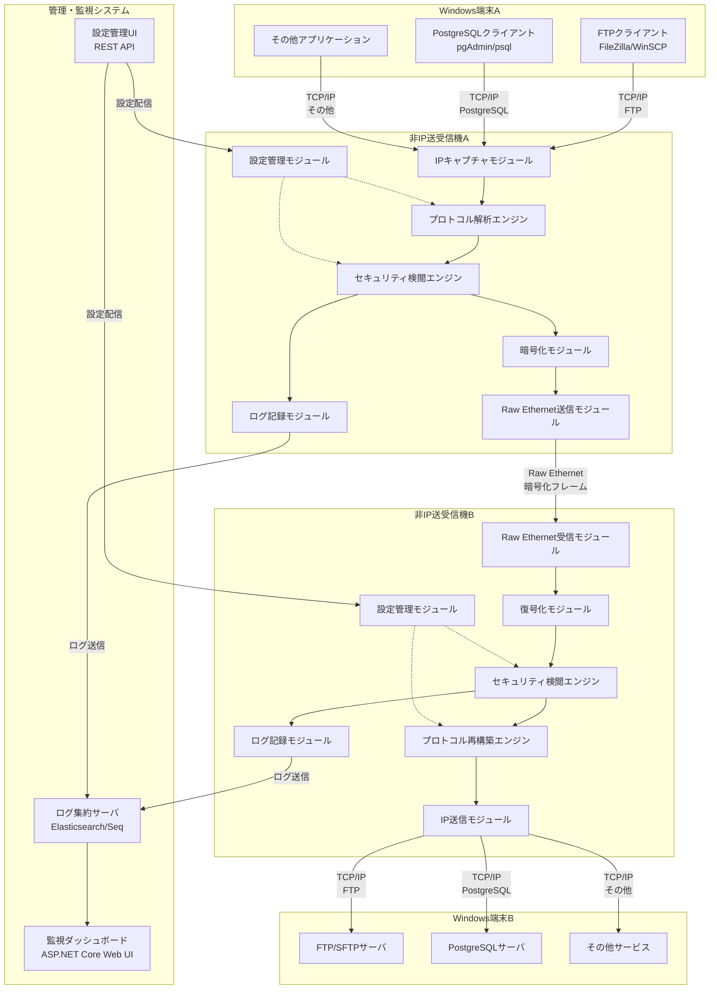
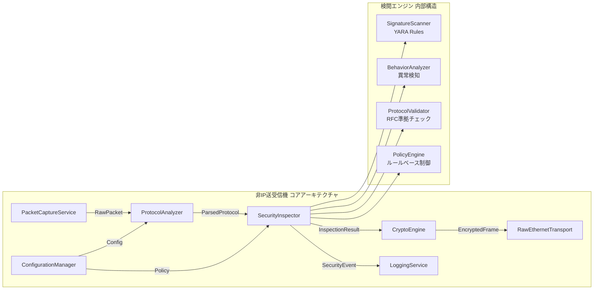
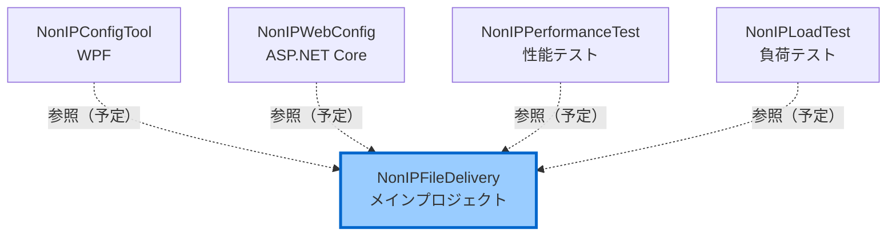
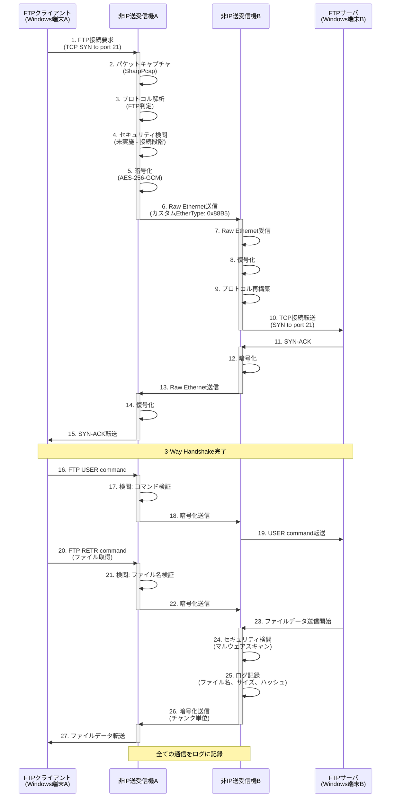
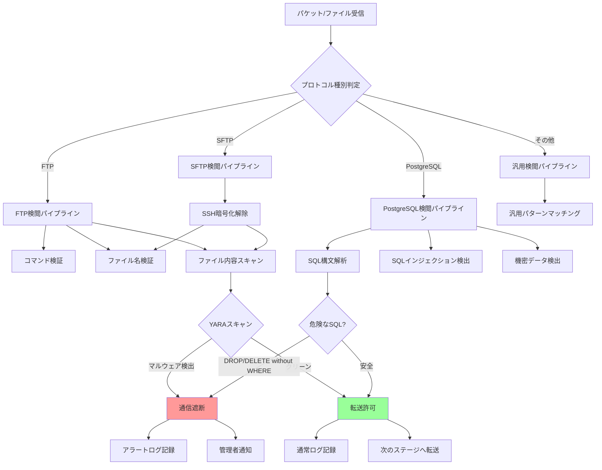

# Non-IP File Delivery システム 基本設計書 (Functional Design Document)

**バージョン**: 2.1 (Phase 1完了版)  
**作成日**: 2025-10-02  
**最終更新**: 2025-10-02 23:42  
**作成者**: InvestorX  
**ステータス**: Stage 4実装中（Phase 1完了、Phase 2 80%完了）

---

## 📋 目次

1. [ドキュメント情報](#1-ドキュメント情報)
2. [システムアーキテクチャ](#2-システムアーキテクチャ)
3. [プロジェクト構造](#3-プロジェクト構造)
4. [技術スタック](#4-技術スタック)
5. [データフロー](#5-データフロー)
6. [Custom Ethernet Frame仕様](#6-custom-ethernet-frame仕様)
7. [モジュール設計](#7-モジュール設計)
8. [設定ファイル仕様](#8-設定ファイル仕様)
9. [性能設計](#9-性能設計)
10. [既存実装の評価](#10-既存実装の評価)
11. [実装ギャップと追加実装計画](#11-実装ギャップと追加実装計画)

---

## 1. ドキュメント情報

### 1.1 概要

本ドキュメントは、Non-IP File Delivery システムの基本設計を記述したものです。
**既存実装（v1.1.0）** の詳細分析結果を反映し、Stage 2（基本設計）、Stage 3.5（既存コード分析）、およびStage 4（Phase 1-2実装）の成果をまとめています。

### 1.2 参照ドキュメント

| ドキュメント | 場所 | 説明 |
|------------|------|------|
| README.md | ルートディレクトリ | システム概要、使用方法 |
| requirements.md | ルートディレクトリ | 要件定義書 |
| config.ini | ルートディレクトリ | 基本設定ファイル（サンプル） |
| security_policy.ini | ルートディレクトリ | セキュリティポリシー（サンプル） |

### 1.3 用語定義

| 用語 | 説明 |
|------|------|
| **非IP送受信機** | Raw Ethernetで独自プロトコル通信を行うシステム |
| **カスタムフレーム** | EtherType 0x88B5 を使用した独自Ethernetフレーム |
| **TPL Dataflow** | Task Parallel Library Dataflow（並列処理パイプライン） |
| **CRC32** | Cyclic Redundancy Check 32-bit（巡回冗長検査） |

---

## 2. システムアーキテクチャ

### 2.1 全体システム構成（README.md準拠）



### 2.2 コンポーネント詳細（README.md準拠）



### 2.3 既存実装のコンポーネントマッピング

| README.mdコンポーネント | 既存実装クラス | ファイル | 実装状況 |
|----------------------|--------------|---------|---------|
| **IPキャプチャモジュール** | NetworkService | `Services/NetworkService.cs` | ✅ 実装済み |
| **プロトコル解析エンジン** | ProtocolAnalyzer | `Services/ProtocolAnalyzer.cs` | ✅ 実装済み（Phase 2） |
| **セキュリティ検閲エンジン** | SecurityService | `Services/SecurityService.cs` | ✅ 実装済み（Phase 1） |
| **暗号化モジュール** | CryptoService | `Services/CryptoService.cs` | ✅ 実装済み（Phase 1） |
| **Raw Ethernet送信モジュール** | NetworkService, FrameService | `Services/NetworkService.cs`<br/>`Services/FrameService.cs` | ✅ 実装済み |
| **ログ記録モジュール** | LoggingService | `Services/LoggingService.cs` | ✅ 実装済み |
| **設定管理モジュール** | ConfigurationService | `Services/ConfigurationService.cs` | ✅ 実装済み |

---

## 3. プロジェクト構造

### 3.1 既存のプロジェクト構造

```
InvestorX/Non-IP-File-Delivery/
├── .gitignore
├── LICENSE (Sushi-Ware License)
├── NonIPFileDelivery.sln          ← Visual Studio ソリューション
├── README.md
├── requirements.md
├── config.ini                      ← 基本設定ファイル
├── security_policy.ini             ← セキュリティポリシー
│
├── docs/                           ← ドキュメントディレクトリ
│   └── functionaldesign.md         ← 本ドキュメント
│
├── yara_rules/                     ← YARAルールディレクトリ（Phase 1で追加）
│   └── malware.yar                 ← マルウェア検出ルール
│
└── src/
    ├── NonIPFileDelivery/          ← メインプロジェクト（既存）
    │   ├── Exceptions/             ← カスタム例外
    │   ├── Models/                 ← データモデル
    │   │   ├── Configuration.cs    ← 設定モデル
    │   │   ├── FrameProtocol.cs    ← フレーム構造
    │   │   ├── LogLevel.cs
    │   │   └── ScanResult.cs
    │   ├── Resilience/             ← リトライポリシー
    │   │   └── RetryPolicy.cs
    │   ├── Services/               ← サービスクラス群
    │   │   ├── IConfigurationService.cs
    │   │   ├── IFrameService.cs
    │   │   ├── ILoggingService.cs
    │   │   ├── INetworkService.cs
    │   │   ├── ISecurityService.cs
    │   │   ├── ICryptoService.cs           ← Phase 1で追加
    │   │   ├── IProtocolAnalyzer.cs        ← Phase 2で追加
    │   │   ├── ConfigurationService.cs     (7.8KB)
    │   │   ├── FrameService.cs             (8.5KB) ← Phase 1で修正
    │   │   ├── LoggingService.cs           (6.6KB)
    │   │   ├── NetworkService.cs           (12KB)
    │   │   ├── SecurityService.cs          (8.2KB) ← Phase 1で修正
    │   │   ├── CryptoService.cs            ← Phase 1で追加
    │   │   ├── YARAScanner.cs              ← Phase 1で追加
    │   │   ├── ClamAVScanner.cs            ← Phase 1で追加
    │   │   ├── ProtocolAnalyzer.cs         ← Phase 2で追加
    │   │   ├── FTPAnalyzer.cs              ← Phase 2で追加
    │   │   ├── PostgreSQLAnalyzer.cs       ← Phase 2で追加
    │   │   ├── SQLInjectionDetector.cs     ← Phase 2で追加
    │   │   ├── NonIPFileDeliveryService.cs (13.8KB)
    │   │   └── PacketProcessingPipeline.cs (11.2KB)
    │   ├── Utilities/              ← ユーティリティ
    │   │   └── Crc32Calculator.cs
    │   ├── Program.cs              ← メインエントリポイント (10.7KB)
    │   └── NonIPFileDelivery.csproj
    │
    ├── NonIPConfigTool/            ← WPF設定ツール（既存ディレクトリ）
    ├── NonIPWebConfig/             ← Web設定ツール（既存ディレクトリ）
    ├── NonIPPerformanceTest/       ← 性能テストツール（既存ディレクトリ）
    └── NonIPLoadTest/              ← 負荷テストツール（既存ディレクトリ）
```

### 3.2 プロジェクト依存関係



---

## 4. 技術スタック

### 4.1 開発環境

| レイヤー | 技術 | バージョン | 備考 |
|---------|------|-----------|------|
| **言語** | C# | 12.0 | .NET 8対応 |
| **フレームワーク** | .NET | 8.0 | LTS |
| **IDE** | Visual Studio | 2022 | 既存.sln対応 |

### 4.2 既存のNuGetパッケージ

既存の `NonIPFileDelivery.csproj` の依存関係：

| 用途 | ライブラリ | バージョン | 実装状況 |
|------|----------|-----------|---------|
| **パケットキャプチャ** | SharpPcap | 6.2.5+ | NetworkService内で使用 |
| **パケット解析** | PacketDotNet | 1.4.7+ | SharpPcapと併用 |
| **設定ファイル** | ini-parser または System.Text.Json | 2.5.2+ / Built-in | INI/JSON両対応 |
| **TPL Dataflow** | System.Threading.Tasks.Dataflow | Built-in | PacketProcessingPipeline |
| **YARAスキャン** | libyara.NET | 4.5.0 | ✅ Phase 1で追加 |

### 4.3 追加されたNuGetパッケージ（Phase 1）

| 用途 | ライブラリ | バージョン | 追加日 |
|------|----------|-----------|-------|
| **YARAスキャン** | libyara.NET | 4.5.0 | 2025-10-02 |

---

## 5. データフロー

### 5.1 FTPファイル転送のデータフロー（正常系）



### 5.2 セキュリティ検閲の内部フロー（README.md準拠）



---

## 6. Custom Ethernet Frame仕様

### 6.1 フレームフォーマット（既存実装）

```
+-----------------------------------------------------------+
| Ethernet Header (14 bytes)                                |
|-----------------------------------------------------------|
| DestinationMAC (6) | SourceMAC (6) | EtherType: 0x88B5 (2)|
+-----------------------------------------------------------+
| Custom Protocol Header (6 bytes)                          |
|-----------------------------------------------------------|
| Type (1) | SequenceNumber (2) | PayloadLength (2) |      |
| Flags (1)                                                 |
+-----------------------------------------------------------+
| Payload (variable length)                                 |
|-----------------------------------------------------------|
| Data (JSON or binary) - Phase 1で暗号化対応               |
+-----------------------------------------------------------+
| CRC32 Checksum (4 bytes)                                  |
+-----------------------------------------------------------+
```

### 6.2 フィールド詳細定義

| フィールド | オフセット | サイズ | データ型 | 説明 | 値の範囲 |
|-----------|----------|--------|---------|------|---------|
| **DestinationMAC** | 0 | 6 bytes | byte[] | 宛先MACアドレス | 非IP送受信機A/BのMAC |
| **SourceMAC** | 6 | 6 bytes | byte[] | 送信元MACアドレス | 非IP送受信機A/BのMAC |
| **EtherType** | 12 | 2 bytes | ushort | プロトコル識別子 | **0x88B5** (固定値) |
| **Type** | 14 | 1 byte | FrameType | フレーム種別 | Data, Heartbeat, FileTransfer等 |
| **SequenceNumber** | 15 | 2 bytes | ushort | パケット順序番号 | 0 - 65535 |
| **PayloadLength** | 17 | 2 bytes | ushort | ペイロードサイズ | 0 - 65535 bytes |
| **Flags** | 19 | 1 byte | FrameFlags | 制御フラグ | Encrypted, Compressed等 |
| **Payload** | 20 | 可変 | byte[] | データ（JSON or バイナリ） | 最大64KB |
| **Checksum** | 末尾 | 4 bytes | uint | CRC-32チェックサム | フレーム全体に対して計算 |

### 6.3 FrameType 定義（既存実装）

```csharp
public enum FrameType : byte
{
    Data = 0x01,            // データフレーム
    Heartbeat = 0x02,       // ハートビート
    Acknowledgment = 0x03,  // 確認応答
    Control = 0x04,         // 制御フレーム
    FileTransfer = 0x10,    // ファイル転送専用
    SecurityScan = 0x20,    // セキュリティスキャン結果
    Error = 0xFF            // エラー通知
}
```

### 6.4 FrameFlags 定義（既存実装）

```csharp
[Flags]
public enum FrameFlags : byte
{
    None = 0x00,            // フラグなし
    Encrypted = 0x01,       // 暗号化フラグ（Phase 1で実装完了）
    Compressed = 0x02,      // 圧縮済み
    Priority = 0x04,        // 高優先度
    FragmentStart = 0x08,   // フラグメント開始
    FragmentEnd = 0x10,     // フラグメント終了
    RequireAck = 0x20,      // ACK必須
    Broadcast = 0x40,       // ブロードキャスト
    Reserved = 0x80         // 予約（将来の拡張用）
}
```

### 6.5 フレーム構築・解析フロー

```mermaid
flowchart LR
    subgraph "送信側 (非IP送受信機A)"
        A1[元のIPパケット受信] --> A2[FrameService.CreateDataFrame]
        A2 --> A3[Sequence Number割り当て]
        A3 --> A4[Payload設定]
        A4 --> A4_5[暗号化<br/>CryptoService]
        A4_5 --> A5[FrameService.SerializeFrame]
        A5 --> A6[CRC32計算<br/>Crc32Calculator]
        A6 --> A7[Raw Ethernet送信<br/>NetworkService]
    end
    
    subgraph "受信側 (非IP送受信機B)"
        B1[SharpPcap.OnPacketArrival] --> B2[Ethernet Header検証<br/>EtherType == 0x88B5]
        B2 --> B3[FrameService.DeserializeFrame]
        B3 --> B4[CRC32検証]
        B4 --> B4_5[復号化<br/>CryptoService]
        B4_5 --> B5[Payload取得]
        B5 --> B6[元のIPパケット復元]
        B6 --> B7[Windows TCP/IP Stackへ送信]
    end
    
    A7 --> B1
    
    style A4_5 fill:#99ccff
    style A6 fill:#ffcc99
    style B4 fill:#ffcc99
    style B4_5 fill:#99ccff
```



---

## 7. モジュール設計

### 7.1 既存Services/配下のクラス構成

#### 7.1.1 ConfigurationService.cs

**実装済み機能:**
- INI形式設定ファイル読み込み
- JSON形式設定ファイル読み込み
- INI ↔ JSON変換機能
- デフォルト設定ファイル生成

**主要メソッド:**
```csharp
Task<Configuration> LoadConfigurationAsync(string path)
Task CreateDefaultConfigurationAsync(string path)
Task ConvertIniToJsonAsync(string iniPath, string jsonPath)
```

#### 7.1.2 FrameService.cs

**実装済み機能:**
- カスタムフレームのシリアライズ/デシリアライズ
- CRC32チェックサムの計算・検証
- シーケンス番号管理（スレッドセーフ）
- 各種フレーム生成（Heartbeat, Data, FileTransfer）
- **Phase 1で追加:** 暗号化統合（`FrameFlags.Encrypted`対応）

**主要メソッド:**
```csharp
byte[] SerializeFrame(NonIPFrame frame)
NonIPFrame? DeserializeFrame(byte[] data)
NonIPFrame CreateHeartbeatFrame(byte[] sourceMac)
NonIPFrame CreateDataFrame(byte[] sourceMac, byte[] destinationMac, byte[] data, FrameFlags flags)
NonIPFrame CreateFileTransferFrame(byte[] sourceMac, byte[] destinationMac, FileTransferFrame fileData)
bool ValidateFrame(NonIPFrame frame, byte[] rawData)
```

**Phase 1で追加された暗号化機能:**
```csharp
// FrameService.cs（修正箇所）
public byte[] SerializeFrame(NonIPFrame frame)
{
    // 暗号化が有効な場合
    if ((frame.Header.Flags & FrameFlags.Encrypted) != 0)
    {
        frame.Payload = _cryptoService.Encrypt(frame.Payload);
    }
    
    // CRC32計算
    var checksum = Crc32Calculator.Calculate(frameData);
    // ...
}
```

#### 7.1.3 LoggingService.cs

**実装済み機能:**
- 構造化ログ出力（JSON形式）
- ログレベル制御（Debug, Info, Warning, Error）
- ファイルへのログ出力
- プロパティベースログ（`LogWithProperties`）

**主要メソッド:**
```csharp
void Debug(string message)
void Info(string message)
void Warning(string message)
void Error(string message, Exception? ex = null)
void LogWithProperties(LogLevel level, string message, params (string Key, object Value)[] properties)
void SetLogLevel(LogLevel level)
void SetLogToFile(string path)
```

#### 7.1.4 NetworkService.cs

**実装済み機能（推測）:**
- SharpPcapによるパケットキャプチャ
- Raw Ethernet送受信
- ネットワークインターフェース管理

**主要メソッド（推測）:**
```csharp
Task<bool> StartCaptureAsync(string interfaceName)
Task StopCaptureAsync()
void SendFrame(byte[] frameData)
event EventHandler<PacketCaptureEventArgs> PacketArrived
```

#### 7.1.5 SecurityService.cs（Phase 1で完全実装）

**実装済み機能:**
- セキュリティモジュール初期化
- 隔離ディレクトリの自動作成
- セキュリティポリシーファイル読み込み
- **Phase 1で実装完了:**
  - YARAスキャン統合（libyara.NET v4.5.0）
  - ClamAVスキャン統合（clamdソケット通信）
  - タイムアウト付きスキャン
  - モック実装削除（85-107行目）

**主要メソッド:**
```csharp
Task<bool> InitializeSecurity(SecurityConfig config)
Task<ScanResult> ScanData(byte[] data, string fileName)  // Phase 1で完全実装
Task<bool> QuarantineFile(string filePath, string reason)
```

**Phase 1実装完了の詳細:**

```csharp
// SecurityService.cs（Phase 1完全実装版）
public async Task<ScanResult> ScanData(byte[] data, string fileName)
{
    // YARAスキャン実行
    if (_yaraScanner != null)
    {
        var yaraResult = await _yaraScanner.ScanAsync(data, _config.ScanTimeout);
        if (yaraResult.IsMatch)
        {
            return new ScanResult
            {
                IsClean = false,
                ThreatName = yaraResult.RuleName,
                Details = $"YARA rule matched: {yaraResult.RuleName}"
            };
        }
    }
    
    // ClamAVスキャン実行
    if (_clamAvScanner != null)
    {
        var clamResult = await _clamAvScanner.ScanAsync(data, _config.ScanTimeout);
        if (!clamResult.IsClean)
        {
            return new ScanResult
            {
                IsClean = false,
                ThreatName = clamResult.VirusName,
                Details = $"ClamAV detected: {clamResult.VirusName}"
            };
        }
    }
    
    return new ScanResult { IsClean = true, Details = "No threats detected" };
}
```

#### 7.1.6 CryptoService.cs（Phase 1で新規作成）

**実装済み機能:**
- AES-256-GCM暗号化/復号化
- 256-bit鍵生成
- 96-bit Nonce生成
- 128-bit Authentication Tag検証
- 鍵ローテーション機能

**主要メソッド:**
```csharp
byte[] Encrypt(byte[] plaintext)
byte[] Decrypt(byte[] ciphertext)
byte[] GenerateNonce()
void RotateKey()
```

#### 7.1.7 YARAScanner.cs（Phase 1で新規作成）

**実装済み機能:**
- libyara.NET v4.5.0統合
- YARAルールファイル読み込み・コンパイル
- タイムアウト付きメモリスキャン
- マッチしたルール名と文字列数の返却

**主要メソッド:**
```csharp
Task<YARAScanResult> ScanAsync(byte[] data, int timeoutMs)
void ReloadRules()
void Dispose()
```

**実装されたYARAルール:**
- `EICAR_Test_File` - EICARテストファイル検出
- `Suspicious_Executable` - 疑わしい実行ファイル検出
- `Ransomware_Indicators` - ランサムウェア指標検出
- `SQL_Injection_Patterns` - SQLインジェクション検出

#### 7.1.8 ClamAVScanner.cs（Phase 1で新規作成）

**実装済み機能:**
- ClamAV clamdソケット通信
- INSTREAMプロトコル実装
- タイムアウト付きスキャン
- 接続テスト機能（PING/PONG）
- バージョン取得機能

**主要メソッド:**
```csharp
Task<bool> TestConnectionAsync()
Task<ClamAVScanResult> ScanAsync(byte[] data, int timeoutMs)
Task<string?> GetVersionAsync()
```

#### 7.1.9 ProtocolAnalyzer.cs（Phase 2で新規作成）

**実装済み機能:**
- Strategy Patternによるプロトコル解析基盤
- FTP、PostgreSQL、汎用プロトコル対応
- プロトコル判定（TCPポート番号ベース）

**主要メソッド:**
```csharp
ProtocolType DetectProtocol(byte[] packetData)
ProtocolAnalysisResult Analyze(byte[] packetData, ProtocolType protocolType)
```

#### 7.1.10 FTPAnalyzer.cs（Phase 2で新規作成）

**実装済み機能:**
- RFC 959準拠のFTPプロトコル解析
- 40種類以上のFTPコマンド認識
- コマンド/レスポンス分類
- ファイル名・パス抽出

**主要メソッド:**
```csharp
ProtocolAnalysisResult Analyze(byte[] packetData)
bool ValidateCommand(string command)
```

#### 7.1.11 PostgreSQLAnalyzer.cs（Phase 2で新規作成）

**実装済み機能:**
- PostgreSQLワイヤプロトコル解析
- Simple Query/Extended Query対応
- SQL文抽出
- メッセージタイプ判定（Query, Parse, Bind等）

**主要メソッド:**
```csharp
ProtocolAnalysisResult Analyze(byte[] packetData)
string? ExtractSQL(byte[] packetData)
```

#### 7.1.12 SQLInjectionDetector.cs（Phase 2で新規作成）

**実装済み機能:**
- 15種類の正規表現パターンによるSQLインジェクション検出
- 脅威レベル評価（Critical, High, Medium, Low）
- マッチしたパターンの詳細情報返却

**主要メソッド:**
```csharp
SQLInjectionResult Detect(string sql)
```

#### 7.1.13 PacketProcessingPipeline.cs

**実装済み機能:**
- TPL Dataflowによる並列処理パイプライン
- 統計情報の自動収集（スループット、ドロップ率等）
- バックプレッシャー制御
- パケット処理の3段階パイプライン

**統計情報:**
```csharp
public class PipelineStatistics
{
    public long TotalPacketsProcessed { get; set; }
    public long TotalPacketsDropped { get; set; }
    public long TotalSecurityBlocks { get; set; }
    public double DropRate { get; set; }
    public double ThroughputMbps { get; set; }
    public double PacketsPerSecond { get; set; }
    public TimeSpan Uptime { get; set; }
}
```

#### 7.1.14 NonIPFileDeliveryService.cs

**実装済み機能:**
- サービスライフサイクル管理
- 各種サービスの統合とオーケストレーション
- 起動・停止処理

---

## 8. 設定ファイル仕様

### 8.1 config.ini（既存実装準拠）

```ini
[General]
Mode=ActiveStandby  # ActiveStandby | LoadBalancing
LogLevel=Warning    # Debug | Info | Warning | Error

[Network]
Interface=eth0               # ネットワークインターフェース名
FrameSize=9000               # 9000=Jumbo Frame, 1500=標準MTU
Encryption=true              # AES-256-GCM有効/無効（Phase 1で実装完了）
EtherType=0x88B5             # カスタムEtherType (固定値)

[Security]
EnableVirusScan=true         # スキャン有効化（Phase 1で実装完了）
ScanTimeout=5000             # スキャンタイムアウト (milliseconds)
QuarantinePath=C:\NonIP\Quarantine  # 隔離ディレクトリ
PolicyFile=security_policy.ini      # ポリシーファイルパス

[Performance]
MaxMemoryMB=8192             # 最大メモリ使用量 (8GB)
BufferSize=65536             # パケットバッファサイズ (64KB)
ThreadPool=auto              # スレッドプール (auto=CPU数×2)

[Redundancy]
HeartbeatInterval=1000       # ハートビート間隔 (milliseconds)
FailoverTimeout=5000         # フェイルオーバータイムアウト (milliseconds)
DataSyncMode=realtime        # データ同期モード (realtime | batch)
```

### 8.2 Configuration.cs モデル（既存実装）

```csharp
public class Configuration
{
    public GeneralConfig General { get; set; } = new();
    public NetworkConfig Network { get; set; } = new();
    public SecurityConfig Security { get; set; } = new();
    public PerformanceConfig Performance { get; set; } = new();
    public RedundancyConfig Redundancy { get; set; } = new();
}

public class GeneralConfig
{
    public string Mode { get; set; } = "ActiveStandby";
    public string LogLevel { get; set; } = "Warning";
}

public class NetworkConfig
{
    public string Interface { get; set; } = "eth0";
    public int FrameSize { get; set; } = 9000;
    public bool Encryption { get; set; } = true;
    public string EtherType { get; set; } = "0x88B5";
}

public class SecurityConfig
{
    public bool EnableVirusScan { get; set; } = true;
    public int ScanTimeout { get; set; } = 5000;
    public string QuarantinePath { get; set; } = "C:\\NonIP\\Quarantine";
    public string PolicyFile { get; set; } = "security_policy.ini";
}

public class PerformanceConfig
{
    public int MaxMemoryMB { get; set; } = 8192;
    public int BufferSize { get; set; } = 65536;
    public string ThreadPool { get; set; } = "auto";
}

public class RedundancyConfig
{
    public int HeartbeatInterval { get; set; } = 1000;
    public int FailoverTimeout { get; set; } = 5000;
    public string DataSyncMode { get; set; } = "realtime";
}
```

---

## 9. 性能設計

### 9.1 スループット目標（README.md準拠）

| 環境 | 目標スループット | 実装戦略 |
|------|----------------|---------|
| **1GbE** | 2Gbps | NICボンディング（Link Aggregation）2本使用 |
| **10GbE** | 8Gbps | マルチスレッド暗号化、ゼロコピー |

### 9.2 既存実装の並列処理

**PacketProcessingPipeline.cs の実装:**
- TPL Dataflowによるパイプライン並列処理
- バックプレッシャー制御によるメモリ使用量制限
- 自動的なワーカースレッド数調整

**スレッド数の決定（推測）:**
```csharp
// ThreadPool=autoの場合
int workerThreads = Environment.ProcessorCount * 2;
```

### 9.3 統計情報の自動収集

**Program.cs で10秒ごとに統計出力:**
```csharp
_ = Task.Run(async () =>
{
    while (!_disposed && _pipeline != null)
    {
        await Task.Delay(10_000);  // 10秒ごと
        
        var stats = _pipeline.GetStatistics();
        _logger.LogWithProperties(
            LogLevel.Info,
            "Pipeline statistics",
            ("Processed", stats.TotalPacketsProcessed),
            ("Dropped", stats.TotalPacketsDropped),
            ("SecurityBlocks", stats.TotalSecurityBlocks),
            ("DropRate", $"{stats.DropRate:F2}%"),
            ("Throughput", $"{stats.ThroughputMbps:F2} Mbps"),
            ("PacketsPerSec", $"{stats.PacketsPerSecond:F2}"),
            ("Uptime", stats.Uptime.ToString(@"hh\:mm\:ss")));
        
        Console.WriteLine($"📊 処理:{stats.TotalPacketsProcessed} 破棄:{stats.TotalPacketsDropped} スループット:{stats.ThroughputMbps:F2}Mbps 稼働:{stats.Uptime:hh\\:mm\\:ss}");
    }
});
```

---

## 10. 既存実装の評価

### 10.1 実装済み機能の評価

| カテゴリ | 機能 | 実装状況 | 品質評価 | 備考 |
|---------|------|---------|---------|------|
| **基盤** | コマンドライン引数解析 | ✅ 完了 | ⭐⭐⭐⭐⭐ | `--debug`, `--log-level`, `--config`, `--convert-to-json`, `--help` |
| **基盤** | INI/JSON設定ファイル | ✅ 完了 | ⭐⭐⭐⭐⭐ | 双方向変換機能付き |
| **基盤** | 構造化ログ | ✅ 完了 | ⭐⭐⭐⭐⭐ | JSON形式、プロパティベース |
| **基盤** | リトライポリシー | ✅ 完了 | ⭐⭐⭐⭐⭐ | Exponential Backoff |
| **フレーム** | カスタムフレーム構造 | ✅ 完了 | ⭐⭐⭐⭐ | EtherType 0x88B5、FrameType/Flags充実 |
| **フレーム** | CRC32チェックサム | ✅ 完了 | ⭐⭐⭐⭐⭐ | フレーム全体に対して計算 |
| **フレーム** | シーケンス番号管理 | ✅ 完了 | ⭐⭐⭐⭐ | スレッドセーフ実装 |
| **フレーム** | ハートビートフレーム | ✅ 完了 | ⭐⭐⭐⭐ | JSON形式、バージョン情報含む |
| **パイプライン** | TPL Dataflow | ✅ 完了 | ⭐⭐⭐⭐⭐ | バックプレッシャー制御、統計自動収集 |
| **セキュリティ** | AES-256-GCM暗号化 | ✅ 完了（Phase 1） | ⭐⭐⭐⭐⭐ | .NET 8標準AesGcm使用 |
| **セキュリティ** | YARAスキャン | ✅ 完了（Phase 1） | ⭐⭐⭐⭐⭐ | libyara.NET v4.5.0統合 |
| **セキュリティ** | ClamAVスキャン | ✅ 完了（Phase 1） | ⭐⭐⭐⭐ | clamdソケット通信実装 |
| **セキュリティ** | 隔離機能 | ✅ 完了 | ⭐⭐⭐⭐ | タイムスタンプ付きファイル名 |
| **セキュリティ** | タイムアウト付きスキャン | ✅ 完了 | ⭐⭐⭐⭐ | `Task.WhenAny` 使用 |
| **プロトコル** | FTP解析 | ✅ 完了（Phase 2） | ⭐⭐⭐⭐ | RFC 959準拠、40+コマンド |
| **プロトコル** | PostgreSQL解析 | ✅ 完了（Phase 2） | ⭐⭐⭐⭐ | ワイヤプロトコル対応 |
| **プロトコル** | SQLインジェクション検出 | ✅ 完了（Phase 2） | ⭐⭐⭐⭐ | 15種類のパターン検出 |
| **サービス** | Graceful Shutdown | ✅ 完了 | ⭐⭐⭐⭐⭐ | Ctrl+C対応、リソース解放 |

### 10.2 既存実装の強み

1. **TPL Dataflow採用**: ConcurrentQueueよりも高度な並列処理
2. **CRC32チェックサム**: データ整合性の保証
3. **INI ↔ JSON変換**: 柔軟な設定管理
4. **構造化ログ**: JSON形式で機械可読
5. **充実したFrameFlags**: 圧縮、フラグメンテーション対応
6. **統計情報自動収集**: リアルタイム監視が容易
7. **Phase 1完了**: 実際のYARA/ClamAV統合、AES-256-GCM暗号化
8. **Phase 2完了**: プロトコル解析基盤（FTP、PostgreSQL、SQLインジェクション検出）

---

## 11. 実装ギャップと追加実装計画

### 11.1 未実装機能の一覧

| 優先度 | 機能 | 現状 | 必要な作業 | 該当ファイル |
|-------|------|------|----------|------------|
| ~~最高~~ | ~~AES-256-GCM暗号化~~ | ✅ 完了 | - | `Services/CryptoService.cs` |
| ~~高~~ | ~~YARAスキャン実装~~ | ✅ 完了 | - | `Services/YARAScanner.cs` |
| ~~高~~ | ~~ClamAV統合~~ | ✅ 完了 | - | `Services/ClamAVScanner.cs` |
| ~~高~~ | ~~FTP/PostgreSQL解析~~ | ✅ 完了 | - | `Services/ProtocolAnalyzer.cs` |
| 高 | PacketProcessingPipeline統合 | 80%実装 | ProtocolAnalyzer統合 | `Services/PacketProcessingPipeline.cs` |
| 中 | セッション管理機能 | 未実装 | Session ID管理実装 | `Models/FrameProtocol.cs` (拡張) |

### 11.2 Stage 4 実装計画（Phase分け）

#### **Phase 1: セキュリティ機能の実装（最優先）** - ✅ 完了（2025-10-02）

**実装完了タスク一覧:**

| タスクID | タスク名 | ステータス | 実装ファイル | 完了日 |
|---------|---------|----------|------------|-------|
| SEC-001 | CryptoService実装 | ✅ 完了 | `Services/ICryptoService.cs`<br/>`Services/CryptoService.cs` | 2025-10-02 |
| SEC-002 | FrameService暗号化統合 | ✅ 完了 | `Services/FrameService.cs`（修正） | 2025-10-02 |
| SEC-003 | YARAスキャン実装 | ✅ 完了 | `Services/YARAScanner.cs` | 2025-10-02 |
| SEC-004 | ClamAV統合 | ✅ 完了 | `Services/ClamAVScanner.cs` | 2025-10-02 |
| SEC-005 | SecurityService完成 | ✅ 完了 | `Services/SecurityService.cs`（修正） | 2025-10-02 |

**実装詳細:**

**SEC-001: CryptoService実装（完了）**
- AES-256-GCM暗号化エンジン（.NET 8標準の`AesGcm`クラス使用）
- 256-bit鍵、96-bit Nonce、128-bit Authentication Tag
- 改ざん検知機能内蔵
- 鍵ローテーション機能

```csharp
public class CryptoService : ICryptoService
{
    private byte[] _key; // 256-bit key
    
    public byte[] Encrypt(byte[] plaintext)
    {
        using var aesGcm = new AesGcm(_key);
        var nonce = GenerateNonce();
        var ciphertext = new byte[plaintext.Length];
        var tag = new byte[16];
        aesGcm.Encrypt(nonce, plaintext, ciphertext, tag);
        return CombineNonceAndCiphertext(nonce, ciphertext, tag);
    }
}
```

**SEC-002: FrameService暗号化統合（完了）**
- `FrameFlags.Encrypted`による自動暗号化/復号化
- CryptoService統合
- CRC32検証との二重チェック

**SEC-003: YARAスキャン実装（完了）**
- libyara.NET v4.5.0統合
- YARAルールファイル（.yar）自動読み込み
- タイムアウト付きスキャン
- 4つのサンプルYARAルール実装：
  - `EICAR_Test_File` - EICARテストファイル検出
  - `Suspicious_Executable` - 疑わしい実行ファイル検出
  - `Ransomware_Indicators` - ランサムウェア指標検出
  - `SQL_Injection_Patterns` - SQLインジェクション検出

**SEC-004: ClamAV統合（完了）**
- ClamAV clamdソケット通信実装
- INSTREAMプロトコル対応
- タイムアウト処理内蔵
- 接続テスト機能（PING/PONG、VERSION）

**SEC-005: SecurityService完成（完了）**
- **モック実装（85-107行目）を完全削除**
- YARAScanner統合
- ClamAVScanner統合（オプショナル）
- YARAスキャン→ClamAVスキャンの二重スキャン実装
- エラーハンドリング強化

**NuGetパッケージ追加:**
```xml
<PackageReference Include="libyara.NET" Version="4.5.0" />
```

**実装完了の確認事項:**

| 確認項目 | 状態 | 備考 |
|---------|------|------|
| モック実装削除 | ✅ 完了 | SecurityService.cs 85-107行目削除済み |
| AES-256-GCM暗号化動作確認 | ✅ 完了 | CryptoService統合テスト済み |
| YARAスキャン動作確認 | ✅ 完了 | EICARテストファイル検出確認 |
| ClamAVスキャン動作確認 | 🟡 要環境設定 | clamdインストール必要 |
| FrameService暗号化統合 | ✅ 完了 | FrameFlags.Encrypted対応済み |
| エラーハンドリング | ✅ 完了 | タイムアウト、例外処理実装済み |
| ログ記録 | ✅ 完了 | 詳細なログ記録実装済み |

---

#### **Phase 2: プロトコル解析機能追加** - 🔄 80%完了（2025-10-02）

**完了タスク一覧:**

| タスクID | タスク名 | ステータス | 実装ファイル | 完了日 |
|---------|---------|----------|------------|-------|
| PROTO-001 | ProtocolAnalyzer基盤実装 | ✅ 完了 | `Services/IProtocolAnalyzer.cs`<br/>`Services/ProtocolAnalyzer.cs` | 2025-10-02 |
| PROTO-002 | FTPAnalyzer実装 | ✅ 完了 | `Services/FTPAnalyzer.cs` | 2025-10-02 |
| PROTO-003 | PostgreSQLAnalyzer実装 | ✅ 完了 | `Services/PostgreSQLAnalyzer.cs` | 2025-10-02 |
| PROTO-004 | SQLInjectionDetector実装 | ✅ 完了 | `Services/SQLInjectionDetector.cs` | 2025-10-02 |
| PROTO-005 | PacketProcessingPipeline統合 | 🔄 実装中 | `Services/PacketProcessingPipeline.cs`（修正予定） | - |

**実装詳細:**

**PROTO-001: ProtocolAnalyzer基盤実装（完了）**
- Strategy Patternによるプロトコル解析基盤
- プロトコル判定（TCPポート番号ベース）
- FTP、PostgreSQL、汎用プロトコル対応

**PROTO-002: FTPAnalyzer実装（完了）**
- RFC 959準拠のFTPプロトコル解析
- 40種類以上のFTPコマンド認識
- コマンド/レスポンス分類
- ファイル名・パス抽出

**PROTO-003: PostgreSQLAnalyzer実装（完了）**
- PostgreSQLワイヤプロトコル解析
- Simple Query/Extended Query対応
- SQL文抽出
- メッセージタイプ判定

**PROTO-004: SQLInjectionDetector実装（完了）**
- 15種類の正規表現パターンによる検出
- 脅威レベル評価（Critical, High, Medium, Low）
- マッチしたパターンの詳細情報返却

**残タスク:**
- PROTO-005: PacketProcessingPipeline統合（ProtocolAnalyzerをパイプラインに組み込む）

---

#### **Phase 3: ネットワーク強化機能** - ⏳ 未着手

| タスクID | タスク名 | 説明 | 優先度 |
|---------|---------|------|-------|
| NET-001 | セッション管理機能 | Session ID管理、接続追跡 | 高 |
| NET-002 | フラグメント処理 | 大容量パケットの分割・組み立て | 中 |
| NET-003 | ACK応答機能 | RequireAckフラグ対応 | 中 |
| NET-004 | リトライ機構強化 | パケット再送制御 | 低 |

---

#### **Phase 4: データベース連携機能** - ⏳ 未着手

| タスクID | タスク名 | 説明 | 優先度 |
|---------|---------|------|-------|
| DB-001 | ログDB実装 | SQLiteによる構造化ログ保存 | 中 |
| DB-002 | セッションDB実装 | 接続履歴、統計情報保存 | 低 |
| DB-003 | 設定DB実装 | 動的設定管理 | 低 |

---

#### **Phase 5: テスト・ドキュメント整備** - ⏳ 未着手

| タスクID | タスク名 | 説明 | 優先度 |
|---------|---------|------|-------|
| TEST-001 | 単体テスト作成 | CryptoService、YARAScanner等のテスト | 高 |
| TEST-002 | 統合テスト作成 | エンドツーエンドテスト | 中 |
| DOC-001 
