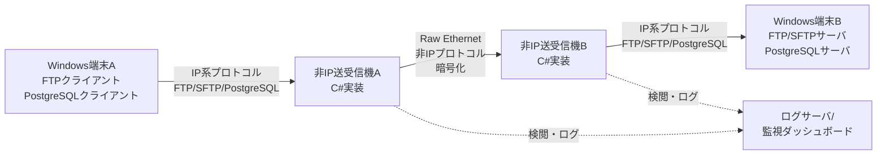

# 非IP送受信機システム 要件定義書

## 1. 目的（Objective）

本システムは、Windows端末間でのファイル転送およびデータベース接続において、Raw Ethernetによる非IPプロトコル通信を実現し、以下を達成することを目的とする:

1. **セキュリティの最大化**: IP系プロトコルの既知脆弱性を回避し、マルウェア・ランサムウェア・不正アクセスから保護
2. **透過的な運用**: 既存のFTP/SFTP/PostgreSQLクライアント・サーバを無改造で利用可能
3. **高性能通信**: 最低2Gbps以上のスループットを確保
4. **将来的な拡張性**: 冗長化、負荷分散、監視機能の追加が容易

## 2. 対象ユーザー（Target Users）

- **セキュリティ管理者**: システムの監視、ログ分析、セキュリティポリシー設定
- **システム管理者**: 非IP送受信機の設置・設定・保守
- **エンドユーザー**: 通常のFTP/SFTPクライアント、PostgreSQLクライアントを使用してファイル転送・DB操作を実行

## 3. コア機能（Core Features）

### 3.1 プロトコル変換機能

**User Story 1: IPからRaw Ethernetへの変換**
- **As a** システム管理者
- **I want to** Windows端末Aからの通常のFTP/SFTP/PostgreSQL通信を、非IP送受信機Aで自動的にRaw Ethernetフレームに変換する
- **So that** 既存のクライアントアプリケーションを改修せずに非IP通信を実現できる

**Use Case:**
```
1. Windows端末AがFTPクライアントでサーバ接続を試行
2. 非IP送受信機Aがパケットをキャプチャ
3. TCP/IPヘッダを解析し、独自のRaw Ethernetフレーム形式に変換
4. 非IP送受信機Bへ送信
```

**User Story 2: Raw EthernetからIPへの逆変換**
- **As a** システム管理者
- **I want to** 非IP送受信機BがRaw Ethernetフレームを受信し、通常のIPパケットに復元してWindows端末Bへ転送する
- **So that** 既存のサーバアプリケーションを改修せずに動作させられる

### 3.2 セキュリティ検閲機能

**User Story 3: マルウェア・ランサムウェア検知**
- **As a** セキュリティ管理者
- **I want to** 転送されるファイルやパケットペイロードをリアルタイムでスキャンし、既知のマルウェアシグネチャを検出する
- **So that** 感染ファイルの送受信を自動的に遮断できる

**検閲項目:**
- ファイルシグネチャベース検査（YARA rulesなど）
- パケットペイロード内の既知攻撃パターン検出
- 異常なプロトコル動作の検知（SQLインジェクション、コマンドインジェクションなど）
- ファイルサイズ/転送速度の異常検知

**User Story 4: 不正通信の遮断とログ記録**
- **As a** セキュリティ管理者
- **I want to** 検閲で脅威を検出した場合、該当通信を即座に遮断し、詳細ログを記録する
- **So that** インシデント対応と事後分析が可能になる

### 3.3 ファイル転送機能

**User Story 5: FTP/SFTP透過的プロキシ**
- **As an** エンドユーザー
- **I want to** 通常のFTPクライアント（FileZilla、WinSCPなど）を使用してファイルをアップロード・ダウンロードする
- **So that** 新しいツールの学習や操作手順の変更が不要である

**対応プロトコル:**
- FTP (RFC 959)
- FTPS (FTP over TLS/SSL)
- SFTP (SSH File Transfer Protocol)

**User Story 6: 大容量ファイル転送の最適化**
- **As a** システム管理者
- **I want to** 2Gbps以上のスループットで数GB〜数十GBのファイルを転送できる
- **So that** 業務効率が低下しない

**実装要件:**
- ゼロコピー技術の活用
- マルチスレッド/非同期I/O処理
- TCPウィンドウサイズの最適化
- フレームのフラグメンテーション/リアセンブリ

### 3.4 データベース接続機能

**User Story 7: PostgreSQL透過的プロキシ**
- **As an** エンドユーザー
- **I want to** pgAdmin、psqlなどの標準的なPostgreSQLクライアントを使用してWindows端末Bのデータベースに接続する
- **So that** 既存のSQL実行環境を変更せずに利用できる

**対応機能:**
- PostgreSQLワイヤプロトコル（ポート5432）の透過的中継
- SQL文の検閲（SQLインジェクション検出）
- クエリログの記録

### 3.5 ロギングと監視機能

**User Story 8: 完全な通信ログ記録**
- **As a** セキュリティ管理者
- **I want to** すべての通信セッション、転送ファイル、SQL文、検閲結果をログに記録する
- **So that** 監査やインシデント調査に使用できる

**ログ項目:**
- タイムスタンプ（ミリ秒精度）
- 送信元/宛先情報
- プロトコル種別
- ファイル名、サイズ、ハッシュ値
- 検閲結果（OK/NG、検出された脅威）
- エラー情報

**User Story 9: リアルタイム監視ダッシュボード**
- **As a** セキュリティ管理者
- **I want to** Webベースのダッシュボードで現在の通信状況、検閲統計をリアルタイム表示する
- **So that** 異常を即座に検知できる

### 3.6 冗長化機能（将来実装）

**User Story 10: アクティブ/スタンバイ構成**
- **As a** システム管理者
- **I want to** 非IP送受信機を複数台配置し、障害時に自動フェイルオーバーする
- **So that** システム停止時間を最小化できる

**要件:**
- ハートビート監視
- セッション状態の同期
- 自動切り替え時間: 5秒以内

## 4. 非機能要件（Non-functional Requirements）

### 4.1 性能要件

| 項目 | 目標値 |
|------|--------|
| スループット | 最低2Gbps、目標8Gbps（10GbE環境） |
| レイテンシ増加 | 通常のIP通信比+10%以内 |
| 同時セッション数 | 100セッション以上 |
| CPU使用率 | 80%以下（最大負荷時） |
| メモリ使用量 | 4GB以下（通常時） |

### 4.2 セキュリティ要件

- **暗号化**: Raw Ethernetフレームのペイロードは AES-256-GCM で暗号化
- **認証**: 非IP送受信機間で相互認証（証明書ベース）
- **改ざん検知**: MACによるフレーム完全性検証
- **鍵管理**: 定期的な鍵ローテーション（24時間ごと）

### 4.3 可用性要件

- **稼働率**: 99.9%以上（月間ダウンタイム43分以内）
- **MTTR**: 5分以内（冗長化時）
- **バックアップ**: 設定ファイルの自動バックアップ

### 4.4 保守性要件

- **ログローテーション**: 自動圧縮・アーカイブ（保存期間: 1年）
- **設定変更**: GUI/CLIでの設定変更、即座に反映
- **アップデート**: 無停止でのセキュリティパターン更新

### 4.5 互換性要件

- **OS**: Windows 10/11, Windows Server 2016/2019/2022
- **.NET**: .NET 6以降
- **ネットワーク**: 1GbE/10GbE Ethernet
- **キャプチャライブラリ**: Npcap 1.70以降

### 4.6 拡張性要件

- **プロトコル追加**: HTTP/HTTPS、SMBなどの将来的対応が容易
- **検閲エンジン**: プラグイン方式で新しい検閲ロジック追加可能
- **スケールアウト**: 非IP送受信機の追加による負荷分散

## 5. システム構成図



## 6. 優先順位

### Phase 1（MVP - 最小実行可能製品）
1. Raw Ethernetフレーム送受信
2. FTPプロトコルの透過的中継
3. 基本的なマルウェアシグネチャ検査
4. ログファイル出力

### Phase 2（機能拡張）
5. SFTP対応
6. PostgreSQL対応
7. リアルタイム監視ダッシュボード
8. 高度な検閲エンジン（YARA統合）

### Phase 3（高可用性）
9. 冗長化機能
10. 負荷分散
11. 性能最適化（10Gbps対応）

## 7. リスクと対策

| リスク | 影響度 | 対策 |
|--------|--------|------|
| Raw Ethernetキャプチャの性能不足 | 高 | Npcapのゼロコピーモード使用、カーネルバッファ最適化 |
| 暗号化によるスループット低下 | 中 | AES-NI命令セット活用、並列処理 |
| 既存プロトコルの完全な互換性確保 | 高 | 徹底的なプロトコル実装テスト、Wiresharkでの検証 |
| 誤検知によるファイル転送失敗 | 中 | ホワイトリスト機能、検閲ルールのチューニング |
